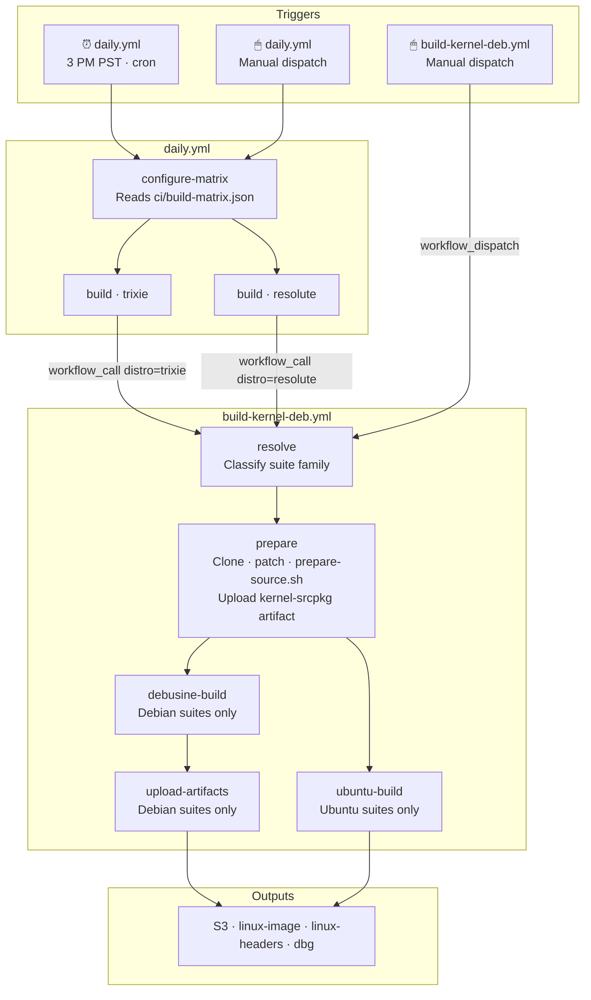
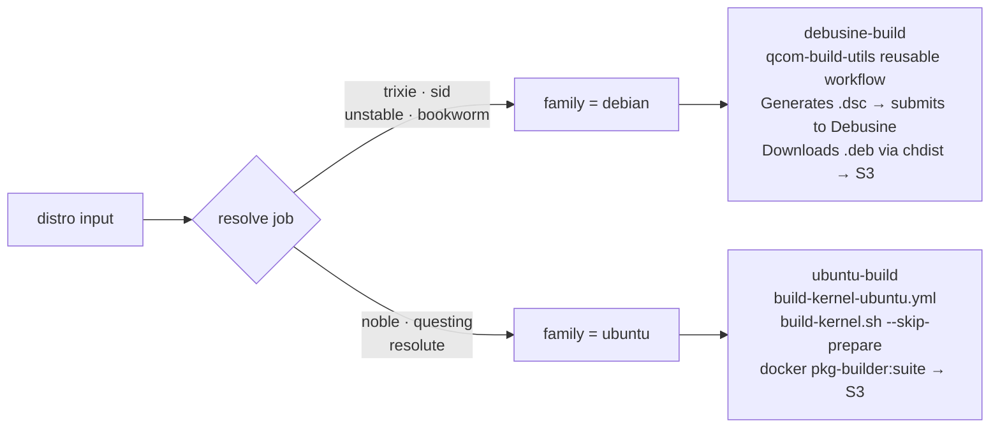
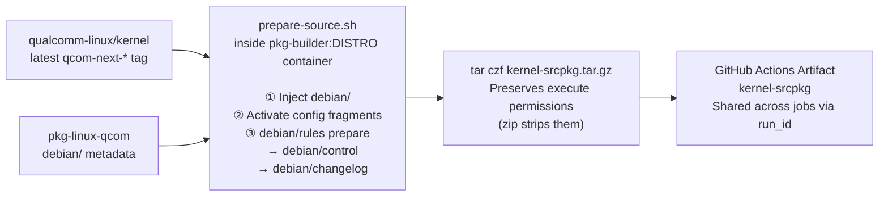
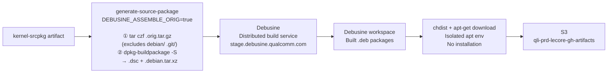
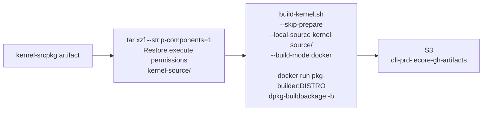

# pkg-linux-qcom

Debian/Ubuntu kernel packaging for `qualcomm-linux/kernel` on ARM64 Qualcomm platforms.
Produces installable `.deb` packages via a dual-path CI pipeline — **Debusine** for Debian suites, **docker** for Ubuntu suites.

---

## Pipeline Overview



---

## Suite Routing



---

## Workflow Files

| File | Role | Trigger |
|---|---|---|
| `daily.yml` | Daily orchestrator — reads matrix, spawns parallel builds | `schedule` · `workflow_dispatch` |
| `build-kernel-deb.yml` | Main build pipeline — 5 jobs, dual-path routing | `workflow_dispatch` · `workflow_call` |
| `build-kernel-ubuntu.yml` | Ubuntu build module — `build-kernel.sh` path | `workflow_call` only |

---

## Daily Build Matrix

**`ci/build-matrix.json`** — one entry per nightly build target:

```json
[
  { "distro": "trixie" },
  { "distro": "resolute" }
]
```

> To add a nightly target: append one entry. No workflow changes needed.

### Manual Dispatch Options (`daily.yml`)

| Input | Type | Behaviour |
|---|---|---|
| `run-full-matrix` ☑ | boolean | Runs all matrix entries — identical to scheduled daily build |
| `run-full-matrix` ☐ + `distro` | choice | Runs a single distro build |

---

## `build-kernel-deb.yml` Inputs

### `workflow_dispatch` (manual single build)

| Input | Default | Description |
|---|---|---|
| `distro` | `trixie` | Target suite |
| `latest-tag` | `true` | Use latest `qcom-next-*` tag |
| `kernel-branch` | `qcom-next` | Branch/tag when `latest-tag=false` |
| `kernel-url` | qualcomm-linux/kernel | Custom kernel repo URL |
| `pkg-linux-qcom-ref` | `qcom/debian/latest` | Packaging metadata ref |
| `localversion` | — | Override LOCALVERSION suffix |
| `kver-extra` | — | Extra suffix appended to package version |
| `debug-build` | `false` | Copies `debug.config` into `debian/config/` |
| `self-pr` | — | Apply a pkg-linux-qcom PR before building |
| `qcom-next-pr` | — | Space-separated qcom-next PR numbers to merge |
| `kernel-topics-pr` | — | Space-separated kernel-topics PR numbers to apply |

### `workflow_call` (called by `daily.yml`)

| Input | Default | Description |
|---|---|---|
| `distro` | `trixie` | Target suite |
| `latest-tag` | `true` | Always true for daily builds |
| `pkg-linux-qcom-ref` | `qcom/debian/latest` | Packaging metadata ref |

---

## Prepare Stage — Source Tree Assembly



> **Why `tar.gz`?** `actions/upload-artifact` uses zip internally, which strips Unix execute bits.
> Kernel build scripts (e.g. `scripts/cc-version.sh`) require execute permission.
> `tar` preserves them end-to-end; `--strip-components=1` restores them on extraction.

---

## Debian Path — Debusine



---

## Ubuntu Path — Docker



> `--skip-prepare` is safe because `prepare-source.sh` already ran in the `prepare` job.
> `debian/control`, `debian/changelog`, and all config fragments are baked into the artifact.

---

## Build Outputs

| Package | Contents | Install |
|---|---|---|
| `linux-image-<kver>-qcom_<ver>_arm64.deb` | Kernel image, `.config`, DTBs, modules | **Required** |
| `linux-headers-<kver>-qcom_<ver>_arm64.deb` | Headers for out-of-tree modules (DKMS) | Optional |
| `linux-image-<kver>-qcom-dbg_<ver>_arm64.deb` | Full debug symbols (`vmlinux`, per-module) | Optional |
| `*.buildinfo` | Reproducible build metadata | Do not install |
| `*.changes` | Upload manifest | Do not install |

### S3 Path

| Path | Build type |
|---|---|
| `s3://qli-prd-lecore-gh-artifacts/<org>/pkg/debusine/<repo>/<suite>/<run_id>-<run_attempt>/` | Debian (Debusine) — suite segment included |
| `s3://qli-prd-lecore-gh-artifacts/<org>/pkg/temp/<repo>/<run_id>-<run_attempt>/` | Ubuntu (docker) — flat layout, no suite segment |

### Install

```bash
sudo dpkg -i linux-image-<kver>-qcom_<ver>_arm64.deb

# Optional: headers for DKMS / out-of-tree modules
sudo dpkg -i linux-headers-<kver>-qcom_<ver>_arm64.deb
```

---

## Repository Variables and Secrets

### Repository Variables (`vars.*`)

| Variable | Value | Used by |
|---|---|---|
| `DEBUSINE_HOST` | `stage.debusine.qualcomm.com` | `debusine-build`, `upload-artifacts` |
| `DEBUSINE_SCOPE` | `qualcomm` | `debusine-build`, `upload-artifacts` |
| `DEBUSINE_PARENT_WORKSPACE` | `qli-ci` | `debusine-build` |

### Secrets (`secrets.*`)

| Secret | Used by |
|---|---|
| `DEBUSINE_USER` | `debusine-build`, `upload-artifacts` |
| `DEBUSINE_TOKEN` | `debusine-build`, `upload-artifacts` |

---

## Deprecation Path

When Debusine gains Ubuntu support:

```
1. Delete  .github/workflows/build-kernel-ubuntu.yml
2. Remove  ubuntu-build job from build-kernel-deb.yml  (3 lines)
3. Update  ci/build-matrix.json  (change resolute entry if needed)
```

Zero changes to `build-kernel-deb.yml` orchestration logic, `prepare-source.sh`, or `debian/`.

---

## License

pkg-linux-kernel is licensed under the BSD-3-clause License. See LICENSE.txt for the full license text.
