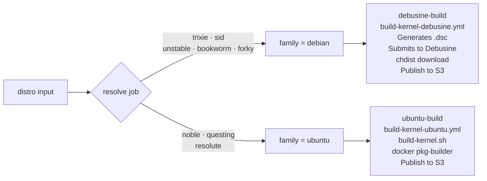
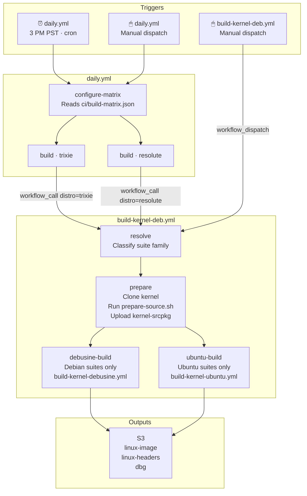
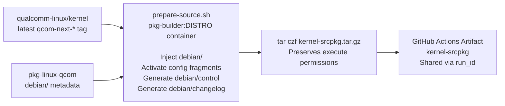
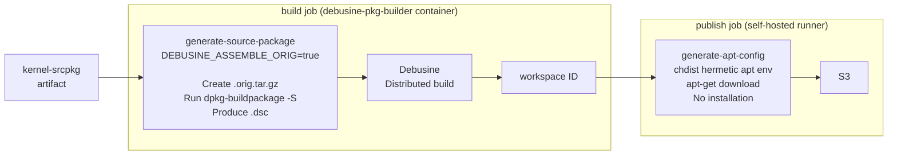
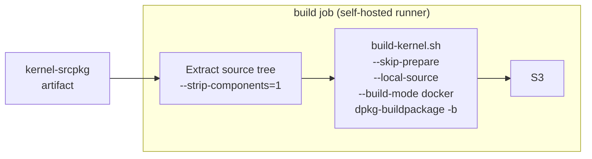

# pkg-linux-qcom

Debian/Ubuntu kernel packaging for `qualcomm-linux/kernel` on ARM64 Qualcomm platforms.
Produces installable `.deb` packages via a dual-path CI pipeline: **Debusine** for Debian suites, **docker** for Ubuntu suites.

This branch (`main`) is the CI orchestrator: the workflows, the build matrix, and this guide.
The `debian/` packaging tree and the local build tooling live on `qcom/debian/latest`; see that branch to build the kernel package locally.

---

## Dispatching a build

To start a build manually, open the repo's **Actions** tab and click **Run workflow**:

- **Single build:** `build-kernel-deb` then **Run workflow**. Pick a `distro` and set the inputs below.
- **Nightly-style run:** `daily` then **Run workflow**. Check **Test Daily Build** to run the full `ci/build-matrix.json` matrix, or leave it unchecked and pick one distro.

Builds also run automatically every night (see [Daily Build Matrix](#daily-build-matrix)).

### `build-kernel-deb.yml` Inputs

#### `workflow_dispatch` (manual single build)

| Input | Default | Description |
|---|---|---|
| `distro` | `trixie` | Target suite |
| `latest-tag` | `true` | Use latest `qcom-next-*` tag |
| `kernel-branch` | `qcom-next` | Branch/tag when `latest-tag=false` |
| `kernel-url` | qualcomm-linux/kernel | Custom kernel repo URL |
| `pkg-linux-qcom-ref` | `qcom/debian/latest` | Packaging metadata ref |
| `localversion` | | Override LOCALVERSION suffix |
| `kver-extra` | | Extra suffix appended to package version |
| `debug-build` | `false` | Copies `debug.config` into `debian/config/` |
| `self-pr` | | Apply a pkg-linux-qcom PR before building |
| `qcom-next-pr` | | Space-separated qcom-next PR numbers to merge |
| `kernel-topics-pr` | | Space-separated kernel-topics PR numbers to apply |

#### `workflow_call` (called by `daily.yml`)

| Input | Default | Description |
|---|---|---|
| `distro` | `trixie` | Target suite |
| `latest-tag` | `true` | Always true for daily builds |
| `pkg-linux-qcom-ref` | `qcom/debian/latest` | Packaging metadata ref |

### Daily Build Matrix

**`ci/build-matrix.json`**: one entry per nightly build target:

```json
[
  { "distro": "trixie" },
  { "distro": "resolute" }
]
```

> To add a nightly target: append one entry. No workflow changes needed.

#### Manual Dispatch Options (`daily.yml`)

| Input | Type | Behaviour |
|---|---|---|
| `run-full-matrix` checked | boolean | Runs all matrix entries, identical to scheduled daily build |
| `run-full-matrix` unchecked + `distro` | choice | Runs a single distro build |

### Build Outputs

| Package | Contents | Install |
|---|---|---|
| `linux-image-<kver>-qcom_<ver>_arm64.deb` | Kernel image, `.config`, DTBs, modules | **Required** |
| `linux-headers-<kver>-qcom_<ver>_arm64.deb` | Headers for out-of-tree modules (DKMS) | Optional |
| `linux-image-<kver>-qcom-dbg_<ver>_arm64.deb` | Full debug symbols (`vmlinux`, per-module) | Optional |
| `*.buildinfo` | Reproducible build metadata | Do not install |
| `*.changes` | Upload manifest | Do not install |

```bash
sudo dpkg -i linux-image-<kver>-qcom_<ver>_arm64.deb

# Optional: headers for DKMS / out-of-tree modules
sudo dpkg -i linux-headers-<kver>-qcom_<ver>_arm64.deb
```

S3 destinations:

| Path | Build type |
|---|---|
| `s3://<artifact-bucket>/<org>/pkg/debusine/<repo>/<suite>/<run_id>-<run_attempt>/` | Debian (Debusine) |
| `s3://<artifact-bucket>/<org>/pkg/temp/<repo>/<run_id>-<run_attempt>/` | Ubuntu (docker) |

---

## Architecture



| File | Role | Trigger |
|---|---|---|
| `daily.yml` | Daily orchestrator: reads matrix, spawns parallel builds | `schedule` · `workflow_dispatch` |
| `build-kernel-deb.yml` | Main pipeline: resolve + prepare, delegates to family modules | `workflow_dispatch` · `workflow_call` |
| `build-kernel-debusine.yml` | Debian build module: source package generation, Debusine submission, publish to S3 | `workflow_call` only |
| `build-kernel-ubuntu.yml` | Ubuntu build module: `build-kernel.sh` via docker, upload to S3 | `workflow_call` only |

---

## For CI maintainers

Internal pipeline detail. Most users do not need this section.

### Pipeline overview



### Prepare stage



> **Why `tar.gz`?** `actions/upload-artifact` uses zip internally, which strips Unix execute bits.
> Kernel build scripts (e.g. `scripts/cc-version.sh`) require execute permission.
> `tar` preserves them end-to-end; `--strip-components=1` restores them on extraction.

### Debian path



### Ubuntu path



> `--skip-prepare` is safe because `prepare-source.sh` already ran in the `prepare` job.
> `debian/control`, `debian/changelog`, and all config fragments are baked into the artifact.

### Required configuration

Set these in the repository (or organization) settings. The Debusine path needs
all of them; the docker path needs only `ARTIFACT_S3_BUCKET`.

| Type | Name | Purpose |
|---|---|---|
| Variable | `ARTIFACT_S3_BUCKET` | S3 bucket the built packages are uploaded to |
| Variable | `DEBUSINE_HOST` | Debusine instance host |
| Variable | `DEBUSINE_SCOPE` | Debusine scope |
| Variable | `DEBUSINE_PARENT_WORKSPACE` | Parent workspace for the CI child workspace |
| Secret | `DEBUSINE_USER` | Debusine API user |
| Secret | `DEBUSINE_TOKEN` | Debusine API token |

`vars.*` are available to all jobs (including `workflow_call` callees) without
forwarding. `secrets.*` do not cross a `workflow_call` boundary unless forwarded,
so `build-kernel-deb.yml` forwards only the two Debusine secrets.

---

## License

pkg-linux-qcom is licensed under the BSD-3-clause License. See LICENSE.txt for the full license text.
