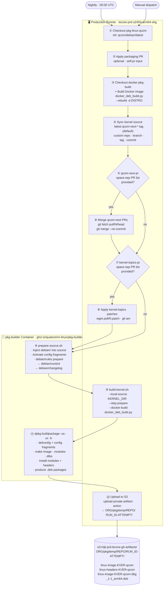
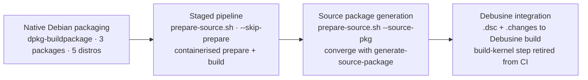

# pkg-linux-qcom

<div align="center">

**Debian packaging metadata, build tooling and CI workflows for the Qualcomm ARM64 Linux kernel**

</div>

---

## Repository Architecture

Two branches, one purpose — CI workflows live on `main`, packaging metadata and tools live on `qcom/debian/latest`. The workflow checks out the packaging branch at runtime.

```
pkg-linux-qcom
│
├── main                          ← CI workflow definitions
│   └── .github/workflows/
│       ├── build-kernel-deb.yml  ← PRIMARY  · nightly + manual
│       └── build-kernel.yml      ← DEPRECATED
│
└── qcom/debian/latest            ← Packaging metadata + build tools
    ├── build-kernel.sh           ← Build orchestrator
    ├── prepare-source.sh         ← Source preparation (single source of truth)
    └── debian/
        ├── rules                 ← dpkg-buildpackage build logic
        ├── control.in            ← Package definitions (@KVER@ template)
        ├── changelog.in          ← Changelog template
        ├── linux-image.postinst.in ← Post-install script template (depmod, initramfs, GRUB)
        ├── linux-image.postrm    ← Post-remove script (GRUB update)
        ├── linux-image.preinst   ← Pre-install script
        ├── clean                 ← Lists generated files for dh_clean
        ├── source/format         ← 3.0 (quilt)
        ├── config/               ← Always-applied config fragments
        └── config-available/     ← Optional fragment library
```

---

## Packages Produced

Three versioned packages per build, named after the full kernel release string `<KVER>` (e.g. `6.12.0-qcom-next-20260210`):

| Package | Contents | Install path |
|---------|----------|-------------|
| `linux-image-<KVER>-qcom` | Kernel image · modules · DTBs · `.config` | `/boot/` · `/lib/modules/<KVER>/` · `/usr/lib/linux-image-<KVER>/` |
| `linux-headers-<KVER>-qcom` | Headers for out-of-tree modules (DKMS) | `/usr/src/linux-headers-<KVER>/` |
| `linux-image-<KVER>-qcom-dbg` | `vmlinux` (unstripped) · per-module debug symbols | `/usr/lib/debug/lib/modules/<KVER>/` |

> **KVER** = base kernel version + LOCALVERSION suffix, e.g. `6.12.0` + `-qcom-next-20260210` → `6.12.0-qcom-next-20260210`. The `-qcom` flavour suffix is appended by the packaging.

---

## Supported Distros

| Distro | Suite | Type |
|--------|-------|------|
| Debian 13 | `trixie` | **Default** |
| Debian unstable | `sid` | |
| Ubuntu 24.04 LTS | `noble` | |
| Ubuntu 25.10 | `questing` | |
| Ubuntu 26.04 | `resolute` | |

---

## CI Pipeline — `build-kernel-deb.yml`



### Execution Environments

| Step | Runs on | What happens |
|------|---------|-------------|
| ①–② Checkout & setup | Prod runner | `git checkout`, env setup |
| ③ Checkout docker-pkg-build + Build docker image | Prod runner | `docker_deb_build.py --rebuild -d <distro>` builds `ghcr.io/qualcomm-linux/pkg-builder:<distro>` |
| ④ Sync kernel source | Prod runner | `git clone --depth 1`; exports `KERNEL_DIR`, `KERNEL_REF`, `KERNEL_SHA` |
| ⑤ Merge qcom-next PRs | Prod runner | `git fetch` + `git merge --no-commit` per PR |
| ⑥ Apply kernel-topics patches | Prod runner | `wget .patch` + `git am` per PR |
| ⑦ Prepare source | **pkg-builder container** | `prepare-source.sh` runs entirely inside the suite-matched container with workspace bind-mounted; injects `debian/`, activates config fragments, generates `debian/control` + `debian/changelog` |
| ⑧ Build kernel package | Prod runner → **pkg-builder container** | `build-kernel.sh --skip-prepare` invoked on runner; dispatches `dpkg-buildpackage` inside the container via `docker_deb_build.py` |
| ⑨ Upload to S3 | Prod runner | `upload-private-artifact-action@aws` uploads `kernel-build/<distro>/` |

---

## Workflow Inputs

### Nightly scheduled run (automatic defaults)

| Parameter | Value |
|-----------|-------|
| Kernel source | Latest `qcom-next-*` tag (auto-resolved via `git ls-remote`) |
| Distro | `trixie` |
| Build mode | `docker` |
| PR integration | none |

### Manual dispatch inputs

| Input | Default | Description |
|-------|---------|-------------|
| `kernel-branch` | `qcom-next` | Branch or tag to build (used when `latest-tag` is `false`) |
| `kernel-url` | *(qualcomm-linux/kernel)* | Custom kernel repo URL; `latest-tag` resolves tags from this URL when set |
| `latest-tag` | `true` | Resolve latest `qcom-next-*` tag automatically; set to `false` to build from a specific branch, tag, or custom repo |
| `localversion` | *(auto)* | LOCALVERSION suffix (auto-detected from git tag) |
| `kver-extra` | — | Extra suffix appended to package version (e.g. `-ci42`) |
| `pkg-linux-qcom-ref` | `qcom/debian/latest` | Packaging branch/commit to use |
| `self-pr` | — | `pkg-linux-qcom` PR number to apply before building |
| `build-mode` | `docker` | `docker` or `native` |
| `distro` | `trixie` | Target distro |
| `qcom-next-pr` | — | Space-separated PR numbers to merge from `qcom-next` |
| `kernel-topics-pr` | — | Space-separated PR numbers from `kernel-topics` to apply as patches |

---

## Tooling — `qcom/debian/latest`

### `prepare-source.sh`

Single source of truth for source preparation. Called by `build-kernel.sh` and directly by the CI `Prepare source` step.

```
prepare-source.sh
  --source-dir DIR        Kernel source directory (required)
  --distro DISTRO         Target distro (default: trixie)
  --localversion SUFFIX   LOCALVERSION suffix (auto-detected from git tag)
  --kver-extra SUFFIX     Extra suffix appended to KVER
  --enable-configs LIST   Comma-separated fragments from config-available/
  --debian-dir DIR        Override debian/ path
```

**Responsibilities:**
1. Inject `debian/` packaging tree into kernel source
2. Activate optional config fragments from `debian/config-available/`
3. Run `debian/rules prepare` → generate `debian/control` + `debian/changelog`

### `build-kernel.sh`

Full build orchestrator. Supports standalone developer use (clone → prepare → build) and CI mode (`--local-source --skip-prepare`).

```
build-kernel.sh
  --local-source DIR      Use existing source (skip clone)
  --skip-prepare          Skip prepare-source.sh call (CI mode)
  --latest-tag            Resolve latest qcom-next-* tag
  --branch / --tag        Specific branch or tag
  --repo URL              Kernel repository URL (default: qualcomm-linux/kernel)
  --distro DISTRO         Target distro
  --build-mode MODE       docker | native | sbuild
  --profiles PROFILES     DEB_BUILD_PROFILES (e.g. debug)
  --enable-configs LIST   Config fragments to activate
  --localversion / --kver-extra
```

> `--skip-prepare` requires `--local-source`. Validated at startup.

### Kernel Configuration Fragments

| Location | Applied | Fragments |
|----------|---------|-----------|
| `debian/config/` | **Always** | `squashfs.config` — SquashFS options for Ubuntu compatibility |
| `debian/config-available/` | **On demand** via `--enable-configs` | `docker.config` · `systemd-boot.config` · `qcom-imsdk.config` · `qemu-boot.config` · `usb-can.config` |

**Config application order:**

```
defconfig → disable LOCALVERSION_AUTO → qcom.config (kernel-source)
→ debian/config/*.config (sorted) → olddefconfig → re-check LOCALVERSION_AUTO
→ [debug.config if DEB_BUILD_PROFILES=debug]
```

---

## S3 Artifact Layout

```
s3://qli-prd-lecore-gh-artifacts/
└── <ORG>/pkg/temp/<REPO>/<RUN_ID>-<ATTEMPT>/
    ├── linux-image-<KVER>-qcom_1-1_arm64.deb
    ├── linux-headers-<KVER>-qcom_1-1_arm64.deb
    └── linux-image-<KVER>-qcom-dbg_1-1_arm64.deb
```

---

## Debusine Integration Roadmap



| Stage | Status | Description |
|-------|--------|-------------|
| Native Debian packaging | ✅ Done | `dpkg-buildpackage`, 3 packages, 5 distros, no external secrets |
| Staged pipeline | ✅ Done | `prepare-source.sh` as first-class CI step; `--skip-prepare` in `build-kernel.sh` |
| Source package generation | 🔄 In design | `--source-pkg` flag; convergence with [`generate-source-package`](https://github.com/qualcomm-linux/equivs-dummy/blob/qcom/debian/latest/ci/generate-source-package) — tracked follow-up from Kernel Deb & DTB Strategy Review (2026-04-15) |
| Debusine integration | 🔮 Future | `.dsc` + `.changes` submitted to Debusine; `Build kernel package` step retired from CI; `build-kernel.sh` remains for developer use |

---

## Local Developer Usage

### Prerequisites

```bash
sudo apt-get install -y \
  build-essential devscripts debhelper-compat bc bison flex \
  libssl-dev libelf-dev dwarves python3 kmod cpio rsync pkg-config make
```

### Quick start

```bash
# Clone packaging repo (qcom/debian/latest branch)
git clone -b qcom/debian/latest git@github.com:qualcomm-linux/pkg-linux-qcom.git
cd pkg-linux-qcom

# Build from latest qcom-next tag (default distro: trixie)
./build-kernel.sh --latest-tag

# Build from specific tag for Ubuntu Noble
./build-kernel.sh --tag qcom-next-6.12.0-20260210 --distro noble

# Build with Docker support enabled
./build-kernel.sh --latest-tag --enable-configs docker,systemd-boot

# Build debug variant
./build-kernel.sh --latest-tag --profiles debug

# Use local kernel source (skip clone)
./build-kernel.sh --local-source /path/to/kernel --localversion qcom-next-20260312
```

### Install built packages

```bash
sudo dpkg -i kernel-build/trixie/linux-image-*-qcom_*.deb
sudo dpkg -i kernel-build/trixie/linux-headers-*-qcom_*.deb
sudo dpkg -i kernel-build/trixie/linux-image-*-qcom-dbg_*.deb
```

---

## Workflow Reference

| Workflow | Trigger | Purpose | Status |
|----------|---------|---------|--------|
| `build-kernel-deb.yml` | Nightly 05:00 UTC + manual | **Primary** — staged pipeline, 3 packages, 5 distros | ✅ Active |
| `build-kernel.yml` | Manual only | Legacy — single package, Ubuntu Noble, `qcom-build-utils` | ⚠️ Deprecated |

---

## License

`pkg-linux-qcom` is licensed under the [BSD 3-Clause License](LICENSE.txt).