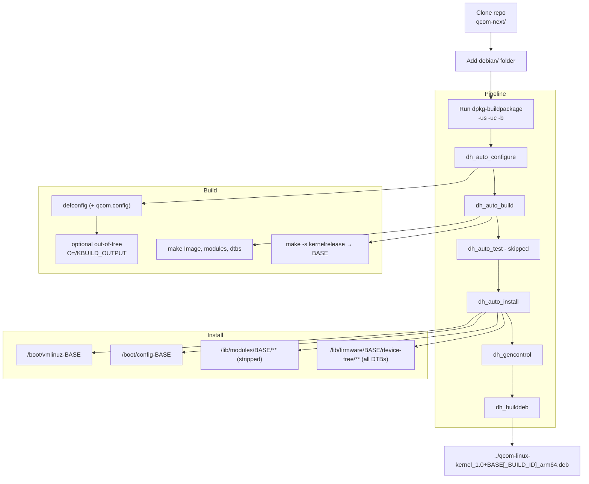

# qcom-linux-kernel — Debian build & packaging

This `debian/` tree compiles **and** packages the Qualcomm ARM64 kernel into a Debian/Ubuntu-installable package named `qcom-linux-kernel`. 



## Features

* Build: `defconfig` (+ `qcom.config` if present), `Image`, `modules`, `dtbs`
* Out-of-tree support: honors `O=` or `KBUILD_OUTPUT`
* DTBs: packages **all** `*.dtb` under `arch/arm64/boot/dts/**` (vendor subdirs preserved)
* Modules: installed with `INSTALL_MOD_STRIP=1`
* Runtime paths keyed to BASE (`make -s kernelrelease`):

  * `/boot/vmlinuz-<BASE>`
  * `/boot/config-<BASE>`
  * `/lib/modules/<BASE>/`
  * `/lib/firmware/<BASE>/device-tree/**`
* Versioning: `1.0+<BASE>[-<BUILD_ID>]`

  * `BUILD_ID` tags package metadata only (runtime `uname -r` unchanged)
* Maintainer scripts:

  * `preinst` cleans prior artifacts for same BASE
  * `postinst` runs `update-initramfs -c -k <BASE>` and `update-grub`
  * `postrm` refreshes GRUB
* Config helper: ensures SQUASHFS options at configure time (Ubuntu rootfs compatibility)

## Prerequisites

```bash
sudo apt-get update
sudo apt-get install -y \
  build-essential devscripts debhelper-compat bc bison flex libssl-dev \
  libelf-dev dwarves python3 kmod cpio rsync pkg-config
```

## Repository layout

Place `debian/` at the kernel source root (next to the kernel `Makefile`):

```
<kernel-src-root>/
├─ Makefile
├─ arch/arm64/...
└─ debian/
   ├─ control
   ├─ rules
   ├─ changelog
   ├─ source/format
   ├─ scripts/enable-squashfs-configs.sh
   ├─ qcom-linux-kernel.preinst
   ├─ qcom-linux-kernel.postinst
   └─ qcom-linux-kernel.postrm
```

## Build

```bash
# Optional: tag package version (metadata only; runtime stays at BASE)
export BUILD_ID=19085636185-1

# Optional: out-of-tree build directory
# export O=/abs/path/to/out
# or:
# export KBUILD_OUTPUT=/abs/path/to/out

# Build unsigned binary package
dpkg-buildpackage -us -uc -b
```

**Result:**

```
../qcom-linux-kernel_1.0+<BASE>[-<BUILD_ID>]_arm64.deb
```

## Install / remove

```bash
# Install
sudo dpkg -i ../qcom-linux-kernel_*.deb
# postinst generates initramfs and updates GRUB

# Remove
sudo dpkg -r qcom-linux-kernel
```

## Installed paths

* `/boot/vmlinuz-<BASE>`
* `/boot/config-<BASE>`
* `/lib/modules/<BASE>/**` (modules stripped)
* `/lib/firmware/<BASE>/device-tree/**` (every `*.dtb` from `arch/arm64/boot/dts/**`)

## Configuration & knobs

* BASE derivation: `make -s kernelrelease`
  If you want `uname -r` to carry a tag, set `LOCALVERSION=-<suffix>` before building (this changes BASE and install paths).
* BUILD_ID: environment variable appended to the **Debian package version** only (e.g., CI build number); does not affect runtime paths or `uname -r`.
* Out-of-tree builds: set `O=` or `KBUILD_OUTPUT`; rules read Image, DTBs, and modules from that objdir.
* SQUASHFS options: `debian/scripts/enable-squashfs-configs.sh` appends required options to `arch/arm64/configs/defconfig` if missing.


