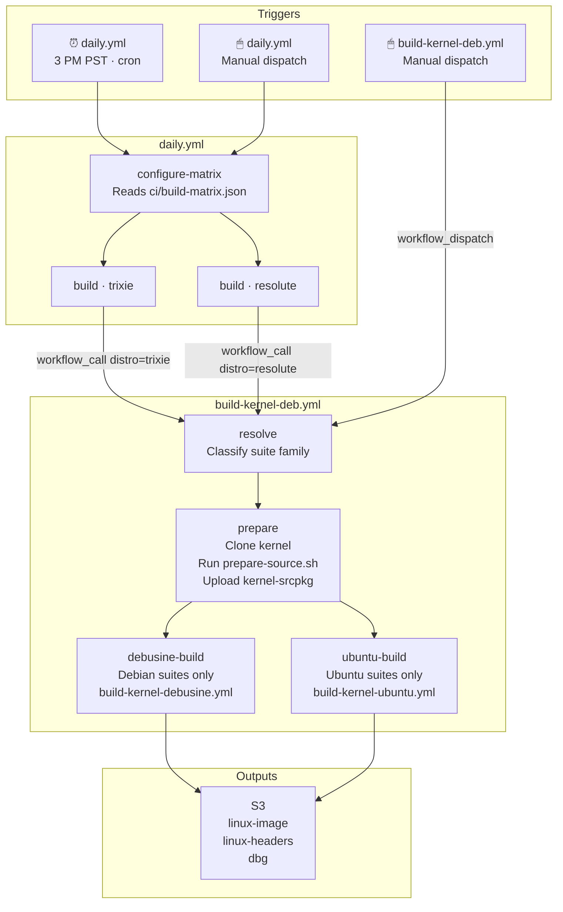
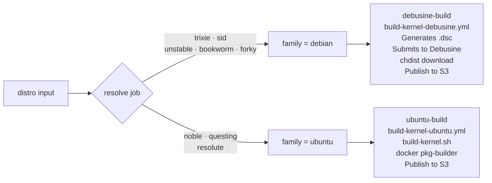
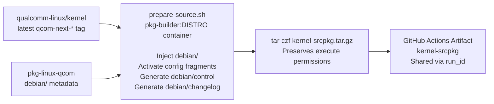
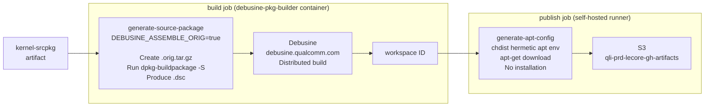
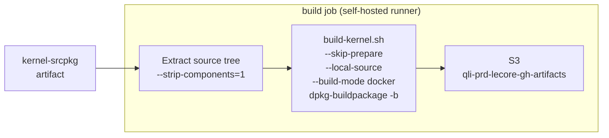

# pkg-linux-qcom

Debian/Ubuntu kernel packaging for `qualcomm-linux/kernel` on ARM64 Qualcomm platforms.
Produces installable `.deb` packages via a dual-path CI pipeline: **Debusine** for Debian suites, **docker** for Ubuntu suites.

---

## Pipeline Overview



---

## Suite Routing



---

## Workflow Files

| File | Role | Trigger |
|---|---|---|
| `daily.yml` | Daily orchestrator: reads matrix, spawns parallel builds | `schedule` · `workflow_dispatch` |
| `build-kernel-deb.yml` | Main pipeline: resolve + prepare, delegates to family modules | `workflow_dispatch` · `workflow_call` |
| `build-kernel-debusine.yml` | Debian build module: source package generation, Debusine submission, publish to S3 | `workflow_call` only |
| `build-kernel-ubuntu.yml` | Ubuntu build module: `build-kernel.sh` via docker, upload to S3 | `workflow_call` only |

---

## Daily Build Matrix

**`ci/build-matrix.json`** — one entry per nightly build target:

```json
[
  { "distro": "trixie" },
  { "distro": "resolute" }
]
```

> To add a nightly target: append one entry. No workflow changes needed.

### Manual Dispatch Options (`daily.yml`)

| Input | Type | Behaviour |
|---|---|---|
| `run-full-matrix` checked | boolean | Runs all matrix entries, identical to scheduled daily build |
| `run-full-matrix` unchecked + `distro` | choice | Runs a single distro build |

---

## `build-kernel-deb.yml` Inputs

### `workflow_dispatch` (manual single build)

| Input | Default | Description |
|---|---|---|
| `distro` | `trixie` | Target suite |
| `latest-tag` | `true` | Use latest `qcom-next-*` tag |
| `kernel-branch` | `qcom-next` | Branch/tag when `latest-tag=false` |
| `kernel-url` | qualcomm-linux/kernel | Custom kernel repo URL |
| `pkg-linux-qcom-ref` | `qcom/debian/latest` | Packaging metadata ref |
| `localversion` | | Override LOCALVERSION suffix |
| `kver-extra` | | Extra suffix appended to package version |
| `debug-build` | `false` | Copies `debug.config` into `debian/config/` |
| `self-pr` | | Apply a pkg-linux-qcom PR before building |
| `qcom-next-pr` | | Space-separated qcom-next PR numbers to merge |
| `kernel-topics-pr` | | Space-separated kernel-topics PR numbers to apply |

### `workflow_call` (called by `daily.yml`)

| Input | Default | Description |
|---|---|---|
| `distro` | `trixie` | Target suite |
| `latest-tag` | `true` | Always true for daily builds |
| `pkg-linux-qcom-ref` | `qcom/debian/latest` | Packaging metadata ref |

---

## Prepare Stage



> **Why `tar.gz`?** `actions/upload-artifact` uses zip internally, which strips Unix execute bits.
> Kernel build scripts (e.g. `scripts/cc-version.sh`) require execute permission.
> `tar` preserves them end-to-end; `--strip-components=1` restores them on extraction.

---

## Debian Path



---

## Ubuntu Path



> `--skip-prepare` is safe because `prepare-source.sh` already ran in the `prepare` job.
> `debian/control`, `debian/changelog`, and all config fragments are baked into the artifact.

---

## Build Outputs

| Package | Contents | Install |
|---|---|---|
| `linux-image-<kver>-qcom_<ver>_arm64.deb` | Kernel image, `.config`, DTBs, modules | **Required** |
| `linux-headers-<kver>-qcom_<ver>_arm64.deb` | Headers for out-of-tree modules (DKMS) | Optional |
| `linux-image-<kver>-qcom-dbg_<ver>_arm64.deb` | Full debug symbols (`vmlinux`, per-module) | Optional |
| `*.buildinfo` | Reproducible build metadata | Do not install |
| `*.changes` | Upload manifest | Do not install |

### S3 Path

| Path | Build type |
|---|---|
| `s3://qli-prd-lecore-gh-artifacts/<org>/pkg/debusine/<repo>/<suite>/<run_id>-<run_attempt>/` | Debian (Debusine) |
| `s3://qli-prd-lecore-gh-artifacts/<org>/pkg/temp/<repo>/<run_id>-<run_attempt>/` | Ubuntu (docker) |

### Install

```bash
sudo dpkg -i linux-image-<kver>-qcom_<ver>_arm64.deb

# Optional: headers for DKMS / out-of-tree modules
sudo dpkg -i linux-headers-<kver>-qcom_<ver>_arm64.deb
```

---

## Credentials and Variables

The Debusine path requires three repository variables and two secrets.
Here is how they flow through the full call stack:

```
daily.yml
  secrets: inherit                        # passes all repo secrets to callee

  └── build-kernel-deb.yml (workflow_call)
        vars.DEBUSINE_PARENT_WORKSPACE    # read directly, passed as input
        secrets.DEBUSINE_USER  ─────────────────────────────────────────┐
        secrets.DEBUSINE_TOKEN ─────────────────────────────────────────┤
                                                                         │ explicit forward
        └── build-kernel-debusine.yml (workflow_call)                   │
              inputs.debusine-parent-workspace ◄─ vars.DEBUSINE_PARENT_WORKSPACE
              secrets.DEBUSINE_USER  ◄──────────────────────────────────┘
              secrets.DEBUSINE_TOKEN ◄──────────────────────────────────┘

              build job:
                vars.DEBUSINE_HOST    # read directly from repo vars
                vars.DEBUSINE_SCOPE   # read directly from repo vars
                secrets.DEBUSINE_TOKEN → authenticates to Debusine API

              publish job:
                vars.DEBUSINE_HOST    # read directly from repo vars
                vars.DEBUSINE_SCOPE   # read directly from repo vars
                secrets.DEBUSINE_USER  → generate-apt-config (netrc)
                secrets.DEBUSINE_TOKEN → generate-apt-config (netrc)
```

`vars.*` are repo-level variables inherited automatically by all jobs and
`workflow_call` callees — no explicit forwarding needed.
`secrets.*` do not inherit across `workflow_call` boundaries unless
explicitly forwarded; `build-kernel-deb.yml` forwards only the two
Debusine secrets, keeping the interface minimal.

---

## License

pkg-linux-qcom is licensed under the BSD-3-clause License. See LICENSE.txt for the full license text.
