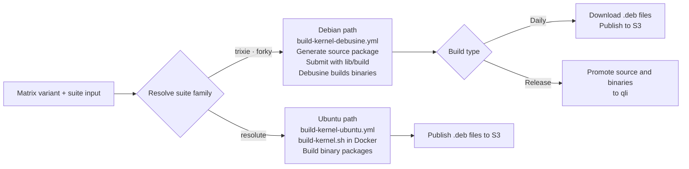
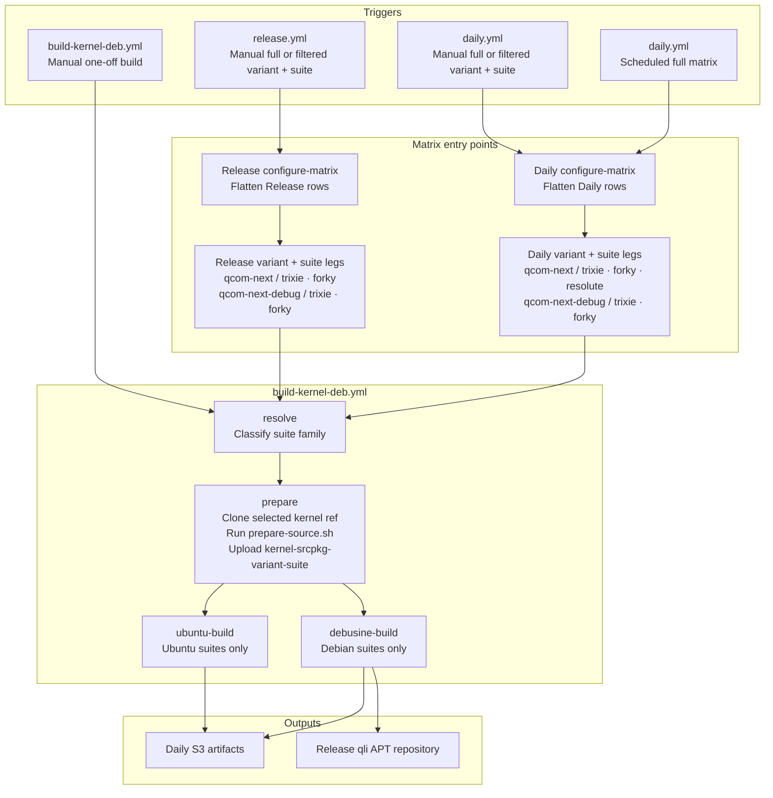
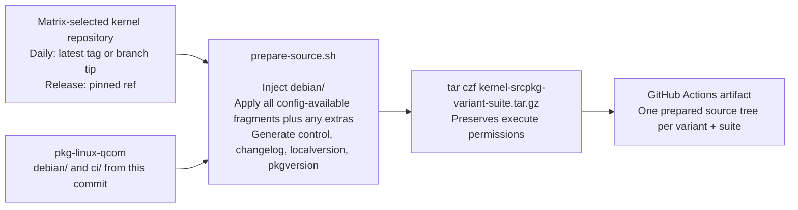
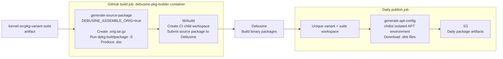
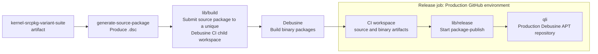
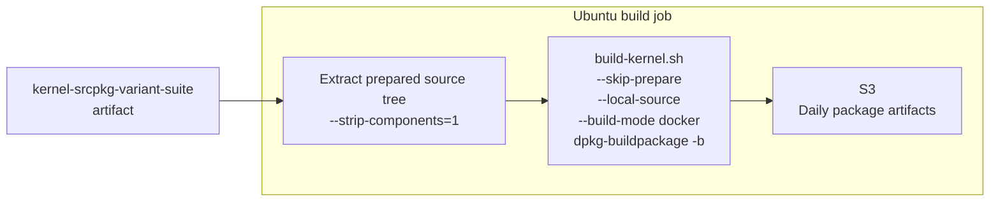

# pkg-linux-qcom

CI orchestration for ARM64 Linux kernel package variants. The configured
variants build from
[`qualcomm-linux/kernel`](https://github.com/qualcomm-linux/kernel).

This branch owns both halves of the chain: the build matrix and GitHub Actions
workflows, and the Debian packaging tree and local packaging tools. Every build
takes its packaging and its CI scripts from the same commit.

## Overview

The CI model is matrix-driven. This single repository can deliver multiple
kernel variants, each with independent source/package identity, kernel source
and ref strategy, configuration fragments, Debian revision, target suites, and
release destination.

Every entry in the matrix is one isolated build leg producing one package. A
kernel flavour owns as many entries as it has suites and delivery types.

### Configured variants

| Variant | Source package | Image metapackage | Daily suites | Release suites | Notes |
|---------|----------------|-------------------|--------------|----------------|-------|
| `qcom-next` | `linux-qcom-next` | `linux-image-qcom-next` | trixie, forky, resolute | trixie, forky | Standard kernel |
| `qcom-next-debug` | `linux-qcom-next-debug` | `linux-image-qcom-next-debug` | trixie, forky | trixie, forky | Adds `arch/arm64/configs/qcom_debug.config` and `kernel/configs/debug.config` from the kernel source, via `intree:` entries |

Both build the same kernel ref. `derive-localversion.sh` folds the *flavour*
into LOCALVERSION, so each produces a distinct kernel release
(`+qcom-next-<date>-g<sha>` and `+qcom-next-debug-<date>-g<sha>`) and therefore a
distinct versioned image package that can be installed alongside the other. See
[docs/version.md](docs/version.md) for how the version strings are composed.
The flavour is what the kernel is; `kernel_variant` is only what CI calls the
build.

`ci/build-matrix.yaml` is the source of truth; this table is a summary.

Two entry points use the same reusable build pipeline:

- **Daily** uses the matrix-selected latest-tag or branch-tip strategy and
  builds every configured Daily suite.
- **Release** uses a pinned matrix ref and promotes successful Debian packages
  to the selected production Debusine workspace.

One entry in `deliveries` is one generated package: a single `kernel_variant`,
a single `type`, and a single `suite`. The `kernel_variant` names that one
build and nothing else — it is the Actions job name and what a manual dispatch
asks for. Nothing is expanded or derived at resolve time, so what an entry says
is what gets built:

```yaml
deliveries:
  - kernel_variant: qcom-next-trixie
    type: Daily
    suite: trixie
    flavour: qcom-next
    git_clone: https://github.com/qualcomm-linux/kernel
    branch_or_tag: qcom-next
    ref_strategy: latest_tag
    tag_pattern: 'qcom-next-*'
    srcpkg: linux-qcom-next
    binpkg: linux-image-qcom-next
    kernel_config: []
    dkms:
      - kgsl
      - camx
      - iris-vpu
      - audioreach
    debian_revision: '0qli1~bpo13+1~'

  - kernel_variant: qcom-next-trixie
    type: Release
    suite: trixie
    flavour: qcom-next
    git_clone: https://github.com/qualcomm-linux/kernel
    branch_or_tag: <pinned-qcom-next-tag>
    ref_strategy: pinned_ref
    srcpkg: linux-qcom-next
    binpkg: linux-image-qcom-next
    kernel_config: []
    dkms:
      - kgsl
      - camx
      - iris-vpu
      - audioreach
    debian_revision: '0qli1~bpo13+1'
    target_workspace: qli
```

Entries are written out in full rather than sharing YAML anchors, so each one
can be read, grepped, and changed on its own. `resolve-matrix.py` enforces the
consistency that duplication would otherwise put at risk — see
[Matrix Model](#matrix-model).

Each entry states its `debian_revision` outright. The configured values are:

| Suite | Daily | Release |
| --- | --- | --- |
| Trixie | `0qli1~bpo13+1~` | `0qli1~bpo13+1` |
| Forky | `0qli1~` | `0qli1` |
| Resolute | `0qli1~26.04.1~` | (not a configured Release suite) |

`~` always sorts below the same prefix without it in Debian version
ordering, so a suite's Daily always sorts below its Release; `resolve-matrix.py`
requires a Daily revision to be exactly its Release revision plus a trailing
`~`. Ordering across *different* suites depends entirely on the configured
revisions: with the values above, Resolute < Trixie < Forky for the same
delivery type, matching a Debian-backports-then-unstable promotion chain.
This is a deliberate ordering policy, not an automatic guarantee — adding a
suite means choosing a revision that sorts where that suite belongs relative to
the others. One nuance to be aware of: because Forky's revision carries no
suite component, its Daily revision ends immediately after the trailing `~`, so
Trixie Daily does not sort below Forky Daily even though Trixie Release sorts
below Forky Release. This does not affect the supported Release-to-Release
upgrade path.

`ci/build-matrix.yaml` is the authoritative configuration. Adding a kernel
variant is a matrix change, not a workflow redesign.

## Workflows

| Workflow | Purpose | Trigger |
| --- | --- | --- |
| `daily.yml` | Resolves and runs the Daily matrix. | Scheduled daily at `23:00 UTC`, or manual dispatch. |
| `release.yml` | Resolves and runs the Release matrix. | Manual dispatch only. |
| `build-kernel-deb.yml` | Reusable orchestrator for one kernel variant and suite. | Manual dispatch or called by Daily and Release. |
| `build-kernel-debusine.yml` | Builds Debian suites in Debusine and either publishes Daily artifacts or promotes Releases. | Called by `build-kernel-deb.yml`. |
| `build-kernel-ubuntu.yml` | Builds Ubuntu-family suites with the Docker path. | Called by `build-kernel-deb.yml`. |

### Daily

Daily is the recurring build and artifact-publication path.

- The scheduled run resolves the full `Daily` matrix.
- A manual run selects one **Build scope**:
  - **Full matrix** builds every configured variant and suite.
  - **Selected variants** builds a comma-separated list of `kernel_variant`
    names, e.g. `qcom-next-trixie,qcom-next-debug-forky`.
  - **Selected flavour (all suites)** builds one flavour in every suite it
    targets.
- `latest_tag` resolves the newest matching dated tag; `branch_tip` resolves
  the configured branch directly.
- Debian suites build in Debusine, then their `.deb` outputs are downloaded and
  uploaded to the configured S3 bucket.
- `resolute` stays on the Docker-based Ubuntu path and uploads its package
  outputs to the existing temporary-package S3 location.

### Release

Release is the controlled promotion path.

- It is manual only and uses one **Release scope** for a kernel variant:
  - **Selected flavour (all suites)** is the normal release action and promotes
    every configured Release suite for that flavour.
  - **Selected variants** promotes a comma-separated list of `kernel_variant`
    names when a targeted action is required.
- It uses the pinned `branch_or_tag` from the selected `Release` matrix row; it
  never resolves a newest tag.
- Debian source and binary artifacts are built in per-flavour, per-suite
  Debusine CI workspaces.
- Successful builds are promoted with Debusine's `package-publish` workflow to
  the `qli` workspace, where they are available through the production Debusine
  APT repository.
- The Release job runs in the **Production** GitHub environment. This provides
  the release credential and enforces the required approval gate before
  promotion to `qli`.

Direct `build-kernel-deb.yml` dispatches are build-only. Release promotion is
initiated exclusively by `release.yml`, which owns the target workspace and
production release controls.

## Matrix Model

`ci/build-matrix.yaml` is a mapping with exactly one top-level key,
`deliveries`. One entry in it is one generated package, so there is no
expansion step: `ci/scripts/resolve-matrix.py` validates the whole document,
selects the entries matching the requested type, variant, and suite, and hands
them to the workflow matrix as they stand. Each entry carries:

| Field | Purpose |
| --- | --- |
| `kernel_variant` | The name of this one build, and nothing else: its Actions job name, and what a manual dispatch asks for. Unique within a delivery type, so a Daily and its Release may share a name. Never reaches a package name, a version, or a published path. Lowercase letters, digits, and internal hyphens only. |
| `type` | `Daily` or `Release`. |
| `suite` | The one suite this entry builds for. |
| `flavour` | The kernel's own identity, and the only matrix field that reaches the built kernel. `derive-localversion.sh` makes it the LOCALVERSION suffix, so two flavours built from one ref get distinct kernel releases and their `linux-image` packages coexist. All entries sharing a flavour build the same package for different suites. |
| `git_clone` | Kernel source repository. |
| `branch_or_tag` | Source branch or pinned tag, according to `ref_strategy`. |
| `ref_strategy` | `latest_tag`, `branch_tip`, or `pinned_ref`. |
| `tag_pattern` | Required only for `latest_tag`; matching tags must end in `-YYYYMMDD`, which determines newest-first ordering. |
| `srcpkg` | Debian source package name. |
| `binpkg` | Kernel image metapackage name. |
| `kernel_config` | Extra fragments applied on top of `debian/config-available/`, all of which is applied to every build, one per list element. A bare name selects `debian/config-available/<name>.config`; an `intree:` entry names a fragment shipped by the kernel source, as a path relative to the kernel source root (e.g. `intree:arch/arm64/configs/qcom_debug.config`), so it stays versioned with the kernel it targets. Empty for variants that need nothing beyond `config-available/`; today it carries only `intree:` fragments. `resolve-matrix.py` joins it into the comma-separated `kernel-config` workflow input. |
| `dkms` | Out-of-tree DKMS modules built and bundled into the image package, one per list element, each named without the `-dkms` suffix (e.g. `kgsl`). Each needs a `<name>-dkms` package in the suite being built for, so this varies between suites. An empty list bundles nothing. A listed module is a presence contract: a build fails rather than shipping an image without it. `resolve-matrix.py` joins it into the comma-separated `dkms` workflow input, which reaches `prepare-source.sh --dkms`; see [debian/README.md](debian/README.md) for what the packaging does with it. |
| `debian_revision` | The Debian revision this package is built at, stated outright. Daily revisions end in `~`; Release revisions do not. |
| `localversion`, `kver_extra` | Optional version overrides forwarded to packaging. |
| `debusine_parent_workspace` | Optional parent workspace override for the variant's CI child workspaces. |
| `target_workspace` | Debusine destination for Release entries only. |

`resolve-matrix.py` rejects the matrix — before any build job starts — where an
entry has an unknown field or a missing required one, a malformed variant or
suite identifier, a `ref_strategy` its `type` does not allow (`Daily` must
track something moving, `Release` must be pinned), a `tag_pattern` without
`latest_tag`, a `target_workspace` on a `Daily` entry or none on a `Release`
one, a `kernel_config` fragment that escapes the kernel source root or collides
with another fragment's filename, a `dkms` entry that is not a package name
stem or repeats, or a `debian_revision` that is not a valid Debian revision or
carries the wrong trailing `~` for its `type`.

Because entries are written out in full, the resolver also checks the
invariants that span them, which is what makes the duplication safe to read at
face value:

- No two entries of one `type` share a `kernel_variant` — a variant names
  exactly one build, so a run cannot produce two jobs with one name and a
  dispatch cannot be ambiguous.
- A flavour's entries agree on `srcpkg`, `binpkg` and `kernel_config`; those
  decide what the package *is*, and the entries differ only in where it goes.
- A flavour's entries for one suite agree on `dkms`. The module set depends on
  which `<name>-dkms` packages the target archive carries, so it varies between
  suites — but a suite's Daily and Release must match, or the Daily is not
  testing the module set the Release will ship.
- A flavour's entries of one `type` agree on `git_clone`, `branch_or_tag`,
  `ref_strategy` and `tag_pattern`, so a forgotten suite cannot quietly ship a
  different kernel from its siblings after a release ref bump.
- Every flavour defines at least one `Daily` and one `Release` entry.
- No `srcpkg` or `binpkg` is shared between flavours, and no two entries build
  the same `srcpkg` at the same `debian_revision`.
- Where a suite has both, its `Daily` revision is its `Release` revision plus a
  trailing `~`.

`build-kernel-deb.yml`'s direct-dispatch path has no matrix context of its own,
so when its `debian-revision` input is empty it looks up the `Daily` entry for
the variant and suite it was given (`resolve-matrix.py --field
debian_revision`) and builds at the revision the daily build would have used.

Each entry has a distinct prepared-source artifact, Debusine child workspace,
and S3 path keyed by `flavour + suite`. This prevents two flavours that both
build, for example, `trixie` from consuming or publishing each other's inputs
or outputs. They key on `flavour`, not `kernel_variant`, so renaming a build
leg never moves a published artifact.

Daily S3 outputs use these layouts, where `<run>` is
`<github.run_id>-<github.run_attempt>`:

```text
<org>/pkg/debusine/<repo>/<flavour>/<suite>/<run>/
<org>/pkg/temp/<repo>/<flavour>/<suite>/<run>/
```

The first layout is for Debian/Debusine builds; the second is for Ubuntu Docker
builds. Consumers must select the intended flavour and suite.

Supporting scripts keep workflow YAML small and testable:

| Script | Responsibility |
| --- | --- |
| `ci/scripts/resolve-matrix.py` | Validates the delivery matrix and selects the entries to build. Needs PyYAML (`python3-yaml`). |
| `ci/scripts/resolve-kernel-ref.sh` | Resolves a matrix-selected dated tag or validates a direct ref. |
| `ci/scripts/derive-localversion.sh` | Derives the version fields from the flavour, resolved kernel ref and HEAD, printing `LOCALVERSION=`, `SNAPSHOT=` and `GITSHA=` lines. `SNAPSHOT` is the dated component of the Debian version: the tag's date, or the HEAD commit date for a branch-tip build. Scheme and rationale: [docs/version.md](docs/version.md). |

## Architecture

This repository contains two separate parts:
- the CI generator (`.github/workflows/`, `ci/`) that decides *what* to build,
- the Debian packaging (`debian/`, `prepare-source.sh`, `build-kernel.sh`) that
  decides *how* it is built.

This document covers the CI generator. For the packaging internals: `debian/rules`
targets, the config fragment merge pipeline, DKMS module bundling and the produced
package layout see [debian/README.md](debian/README.md).


```mermaid
flowchart LR
    IN["Matrix variant + suite input"] --> R{"Resolve suite family"}

    R -->|"trixie · forky"| DEB["Debian path\nbuild-kernel-debusine.yml\nGenerate source package\nSubmit with lib/build\nDebusine builds binaries"]
    R -->|"resolute"| UBU["Ubuntu path\nbuild-kernel-ubuntu.yml\nbuild-kernel.sh in Docker\nBuild binary packages"]

    DEB --> DOUT{"Build type"}
    DOUT -->|Daily| S3["Download .deb files\nPublish to S3"]
    DOUT -->|Release| QLI["Promote source and binaries\nto qli"]
    UBU --> US3["Publish .deb files to S3"]
```

## For CI Maintainers

### Pipeline overview


```mermaid
flowchart TD
    subgraph triggers[Triggers]
        A1["daily.yml\nScheduled full matrix"]
        A2["daily.yml\nManual full or filtered variant + suite"]
        A3["release.yml\nManual full or filtered variant + suite"]
        A4["build-kernel-deb.yml\nManual one-off build"]
    end

    subgraph matrix[Matrix entry points]
        B1["Daily configure-matrix\nFlatten Daily rows"]
        B2["Daily variant + suite legs\nqcom-next / trixie · forky · resolute\nqcom-next-debug / trixie · forky"]
        B3["Release configure-matrix\nFlatten Release rows"]
        B4["Release variant + suite legs\nqcom-next / trixie · forky\nqcom-next-debug / trixie · forky"]
    end

    subgraph orchestrator[build-kernel-deb.yml]
        C1["resolve\nClassify suite family"]
        C2["prepare\nClone selected kernel ref\nRun prepare-source.sh\nUpload kernel-srcpkg-variant-suite"]
        C3["debusine-build\nDebian suites only"]
        C4["ubuntu-build\nUbuntu suites only"]
    end

    subgraph outputs[Outputs]
        D1["Daily S3 artifacts"]
        D2["Release qli APT repository"]
    end

    A1 --> B1
    A2 --> B1
    A3 --> B3
    B1 --> B2 --> C1
    B3 --> B4 --> C1
    A4 --> C1
    C1 --> C2
    C2 --> C3 & C4
    C3 --> D1 & D2
    C4 --> D1
```

### Prepare stage


```mermaid
flowchart LR
    K["Matrix-selected kernel repository\nDaily: latest tag or branch tip\nRelease: pinned ref"] --> PS
    M["pkg-linux-qcom\ndebian/ and ci/ from this commit"] --> PS

    PS["prepare-source.sh\n\nInject debian/\nApply all config-available fragments plus any extras\nGenerate control, changelog, localversion, pkgversion"] --> TAR
    TAR["tar czf kernel-srcpkg-variant-suite.tar.gz\nPreserves execute permissions"] --> ART
    ART["GitHub Actions artifact\nOne prepared source tree per variant + suite"]
```

> **Why `tar.gz`?** `actions/upload-artifact` uses zip internally, which strips
> Unix execute bits. Kernel build scripts require those permissions. The tar
> archive preserves them between the prepare and build jobs.

### Debian Daily path


```mermaid
flowchart LR
    ART["kernel-srcpkg-variant-suite\nartifact"] --> GSP

    subgraph source[GitHub build job: debusine-pkg-builder container]
        GSP["generate-source-package\nDEBUSINE_ASSEMBLE_ORIG=true\n\nCreate .orig.tar.gz\nRun dpkg-buildpackage -S\nProduce .dsc"] --> SUBMIT
        SUBMIT["lib/build\nCreate CI child workspace\nSubmit source package to Debusine"]
    end

    SUBMIT --> DEB["Debusine\nBuild binary packages"]
    DEB --> WS["Unique variant + suite workspace"]

    subgraph publish[Daily publish job]
        WS --> APT["generate-apt-config\nchdist isolated APT environment\nDownload .deb files"]
        APT --> S3["S3\nDaily package artifacts"]
    end
```

### Debian Release path


```mermaid
flowchart LR
    ART["kernel-srcpkg-variant-suite\nartifact"] --> GSP["generate-source-package\nProduce .dsc"]
    GSP --> SUBMIT["lib/build\nSubmit source package to a unique\nDebusine CI child workspace"]
    SUBMIT --> DEB["Debusine\nBuild binary packages"]
    DEB --> WS["CI workspace\nsource and binary artifacts"]

    subgraph release[Release job: Production GitHub environment]
        WS --> PROMOTE["lib/release\nStart package-publish"]
        PROMOTE --> QLI["qli\nProduction Debusine APT repository"]
    end
```

### Ubuntu path


```mermaid
flowchart LR
    ART["kernel-srcpkg-variant-suite\nartifact"] --> EXT

    subgraph build[Ubuntu build job]
        EXT["Extract prepared source tree\n--strip-components=1"] --> BK
        BK["build-kernel.sh\n--skip-prepare\n--local-source\n--build-mode docker\ndpkg-buildpackage -b"] --> S3
    end

    S3["S3\nDaily package artifacts"]
```

`--skip-prepare` is safe because `prepare-source.sh` has already generated the
packaging metadata and applied the config fragments before the artifact is
created.

## Packages

The matrix provides the source package and image metapackage identity. The
resolved kernel release remains the source of truth for versioned package names
and installed kernel paths.

For the current matrix, package generation produces:

| Package | Purpose |
| --- | --- |
| `linux-qcom-next_<version>.dsc` and related source files | Debian source package. |
| `linux-image-<kernelrelease>_<version>_arm64.deb` | Versioned kernel image, modules, DTBs, and boot assets. |
| `linux-image-qcom-next_<version>_arm64.deb` | Image metapackage that tracks the newest kernel image. |
| `linux-headers-<kernelrelease>_<version>_arm64.deb` | Versioned headers for DKMS and out-of-tree modules. |
| `linux-headers-qcom-next_<version>_arm64.deb` | Headers metapackage. |
| `linux-image-<kernelrelease>-dbg_<version>_arm64.deb` | Kernel and module debug symbols. |

`-rcN` remains in `uname -r`, module paths, boot assets, and versioned package
names. Only the Debian version field converts it to `~rcN`, so a release
candidate correctly sorts before the corresponding final kernel release.

Every build names both its snapshot and the commit it was cut from:

| | Format | Example |
| --- | --- | --- |
| Kernel release (`uname -r`) | `<base>+<variant>-<date>[.<respin>]-g<sha>` | `7.2.0-rc7+qcom-next-20260826.1-g011a82096bee` |
| Debian version | `<base>+git<date>[.<respin>]~g<sha>-<revision>` | `7.2.0~rc7+git20260826.1~g011a82096bee-0qli1~bpo13+1` |

The two strings spell the same fields differently because they are compared by
different rules — `+` and `~` are both load-bearing, not stylistic. See
[docs/version.md](docs/version.md) before changing either.

`KVER_EXTRA` is supported for explicit suffixes such as `-ci42` or `-local`.
The packaging rules verify that the declared versioned image package matches the
resolved kernel release and fail instead of creating inconsistent metadata.

For an APT repository installation, install the image metapackage:

```bash
sudo apt update
sudo apt install linux-image-qcom-next
```

When installing downloaded artifacts directly, install the versioned image and
its metapackage together. Add the headers packages when DKMS or other
out-of-tree module builds are required.

## Manual Builds

Use **Actions** → **build-kernel-deb** for a one-off build. It is an explicit
override workflow, not a matrix-derived delivery flow: use `daily.yml` and
`release.yml` for normal Daily and Release operations.

`kernel-variant`, `suite`, and `ref-strategy` are the required build selection.
All remaining package, configuration, and PR inputs are advanced overrides for
validation or debugging. Variant and suite are free-text matrix values rather
than static dropdowns, so adding a matrix entry never requires editing the
workflow UI.

The available inputs are:

| Input | Default | Purpose |
| --- | --- | --- |
| `kernel-variant` | `qcom-next-trixie` | Names this build; also selects the matrix entry a blank `debian-revision` is taken from. |
| `flavour` | `qcom-next` | Kernel flavour: the LOCALVERSION suffix, and so the kernel release identity. |
| `suite` | `trixie` | Target suite. |
| `ref-strategy` | `latest_tag` | `latest_tag`, `branch_tip`, or `pinned_ref`. |
| `kernel-branch` | `qcom-next` | Branch for `branch_tip`, or immutable ref for `pinned_ref`; ignored by `latest_tag`. |
| `tag-pattern` | `qcom-next-*` | Tag glob for `latest_tag`; ignored by `branch_tip` and `pinned_ref`. |
| `kernel-url` | `qualcomm-linux/kernel` | Advanced alternate kernel repository. |
| `srcpkg` | `linux-qcom-next` | Advanced source package identity override. |
| `binpkg` | `linux-image-qcom-next` | Advanced image metapackage identity override. |
| `kernel-config` | Empty | Advanced extra fragments applied on top of all of `debian/config-available/`, e.g. `intree:arch/arm64/configs/qcom_debug.config`. |
| `dkms` | Empty | Advanced comma-separated DKMS modules bundled into the image package, each without the `-dkms` suffix. Empty bundles none. |
| `debian-revision` | The matrix Daily revision | Advanced Debian revision override. Left empty, the build takes the `debian_revision` of the matrix's `Daily` entry for the selected variant and suite; direct builds always use the Daily entry since they are build-only and non-promoting. |
| `localversion` | Auto-derived | Advanced explicit `LOCALVERSION` override. |
| `kver-extra` | Empty | Advanced kernel-release suffix. |
| `debug-build` | `false` | Advanced debug configuration toggle. |

The workflow also supports advanced Qualcomm-only PR overrides for validation
builds. Direct builds are artifact builds; Release promotion is performed only
through `release.yml`.

## Configuration

### Repository and organization variables

| Variable | Purpose |
| --- | --- |
| `ARTIFACT_S3_BUCKET` | S3 bucket for Daily Debian artifacts and Ubuntu build artifacts. |
| `DEBUSINE_HOST` | Production Debusine host. |
| `DEBUSINE_SCOPE` | Debusine scope. |
| `DEBUSINE_PARENT_WORKSPACE` | Parent workspace used to create per-run CI child workspaces. |

### Secrets

| Secret | Scope | Purpose |
| --- | --- | --- |
| `DEBUSINE_USER` | Repository | User for Debusine archive and signing-key access. |
| `DEBUSINE_TOKEN` | Repository | Token for Debusine build and artifact operations. |
| `DEBUSINE_RELEASE_TOKEN` | Production environment | Token used only to promote Release artifacts to `qli`. |

The Debian build and Release jobs select the **Production** GitHub environment.
This makes environment-scoped release credentials available to the promotion job
and keeps production approval controls in the workflow path.

## Maintaining the Matrix

To add a kernel variant:

1. Add one entry to `deliveries` per package the variant should produce: one
   per Daily suite and one per Release suite, each spelling out all of its own
   fields, and each with a `kernel_variant` unique within its delivery type.
   Do not rely on another variant's values.
2. Give them all the same `flavour`, distinct from every other flavour's — it
   becomes the LOCALVERSION suffix, so this is what lets the new kernel install
   alongside the existing ones. Keep `srcpkg`, `binpkg` and `kernel_config`
   identical across every entry for the flavour, and the ref fields identical
   across its entries of one `type`. `resolve-matrix.py` rejects the matrix if
   they drift apart.
3. Use `latest_tag` with a dated tag glob or `branch_tip` for Daily. Use
   `pinned_ref` for Release, and update that ref through a reviewed PR.
4. Give the variant distinct `srcpkg` and `binpkg` values. Set
   `target_workspace` on each Release entry.
5. Give each entry a `debian_revision`: the Daily one is the Release one for
   the same suite plus a trailing `~`.
6. Confirm suite-family routing: Debian suites use Debusine; Ubuntu suites use
   the Docker path.
7. Run a filtered Daily validation for the new variant, then its full Daily and
   Release flows.

To add a new suite (for an existing or new variant):

1. Add one entry per delivery type the suite should get, copying the variant's
   existing entry for that type and changing `suite` and `debian_revision`.
2. Choose the revision so the suite sorts where it belongs relative to the
   others for the same delivery type (see the ordering discussion in
   [Overview](#overview)), and so it does not collide with another entry
   building the same `srcpkg`.

No workflow dispatch choices need to be updated: manual Daily and Release
inputs accept matrix-defined variant and suite strings.

Run `ci/scripts/resolve-matrix.py --type Daily` and `--type Release` locally to
validate a matrix change before pushing it; both validate the whole document,
so either one catches a mistake in the other's entries.

## Contributing

See [CONTRIBUTING.md](CONTRIBUTING.md) for branch, review, and DCO
requirements.

## License

pkg-linux-qcom is licensed under the BSD 3-Clause License. See
[LICENSE.txt](LICENSE.txt).
