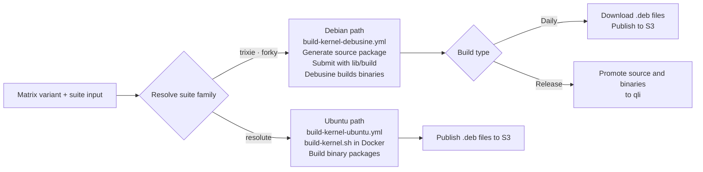
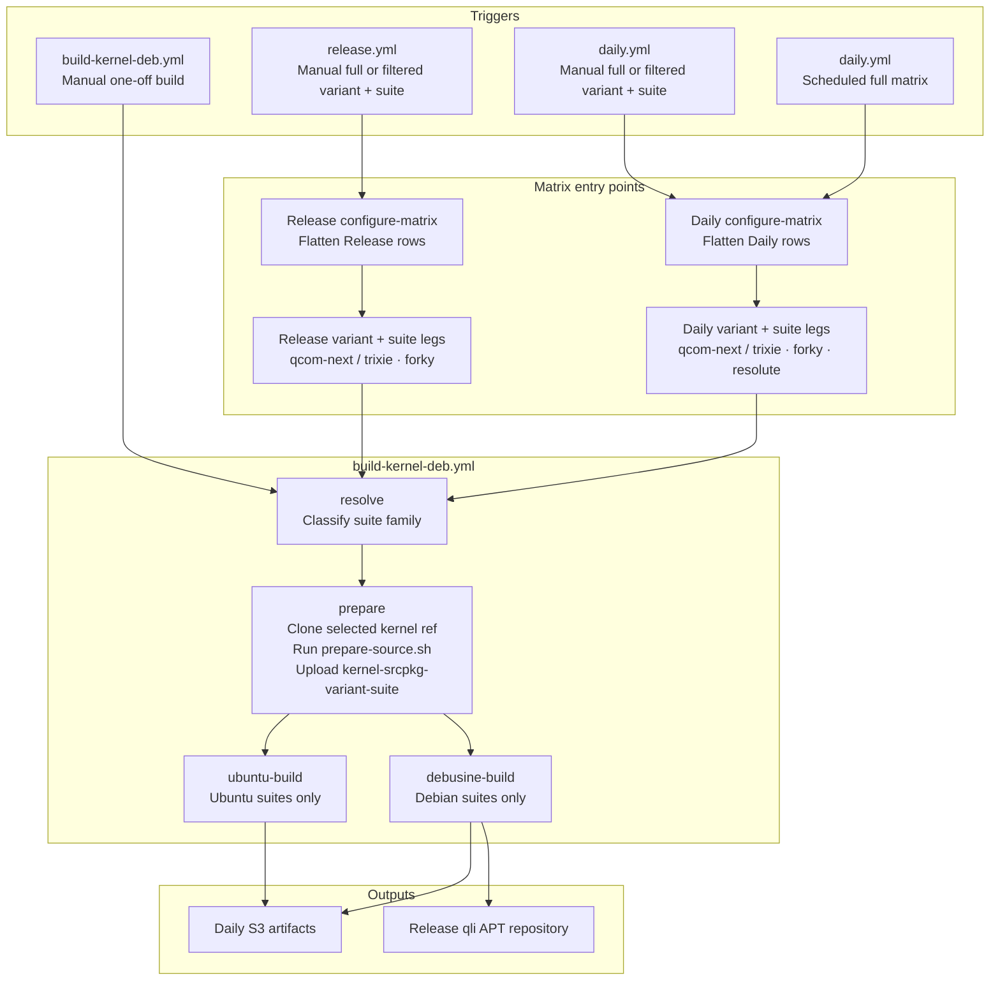
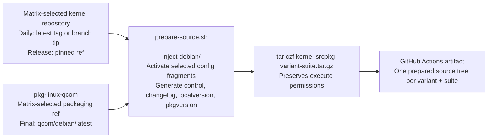
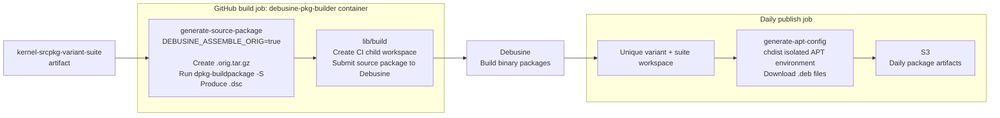
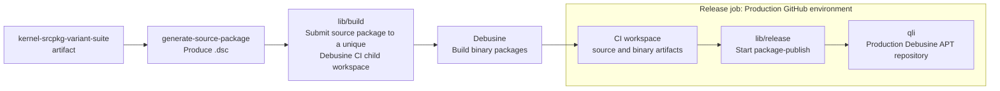
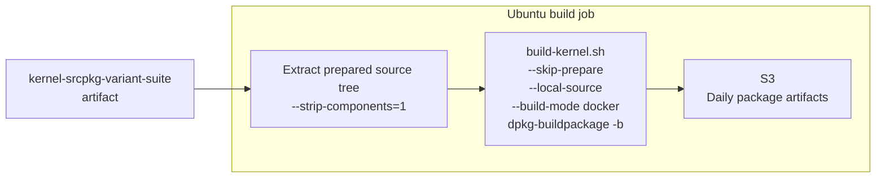

# pkg-linux-qcom

CI orchestration for ARM64 Linux kernel package variants. The current variant
builds from [`qualcomm-linux/kernel`](https://github.com/qualcomm-linux/kernel).

This branch owns the build matrix and GitHub Actions workflows. The Debian
packaging tree and local packaging tools live on
[`qcom/debian/latest`](https://github.com/qualcomm-linux/pkg-linux-qcom/tree/qcom/debian/latest).

## Overview

The CI model is matrix-driven. This single repository can deliver multiple
kernel variants, each with independent source/package identity, kernel source
and ref strategy, configuration fragments, Debian revision, target suites, and
release destination.

Every kernel variant owns exactly two complete matrix rows: one `Daily` row and
one `Release` row. The resolver expands every suite in those rows into an
isolated `kernel_variant + suite` build leg.

Two entry points use the same reusable build pipeline:

- **Daily** uses the matrix-selected latest-tag or branch-tip strategy and
  builds every configured Daily suite.
- **Release** uses a pinned matrix ref and promotes successful Debian packages
  to the selected production Debusine workspace.

The final Production matrix is conceptually:

```json
{
  "suite_suffix_mapping": {
    "trixie": "~bpo13+1",
    "forky": "",
    "resolute": "~26.04.1"
  },
  "deliveries": [
    {
      "kernel_variant": "qcom-next",
      "type": "Daily",
      "suites": ["trixie", "forky", "resolute"],
      "git_clone": "https://github.com/qualcomm-linux/kernel",
      "branch_or_tag": "qcom-next",
      "ref_strategy": "latest_tag",
      "tag_pattern": "qcom-next-*",
      "srcpkg": "linux-qcom-next",
      "binpkg": "linux-image-qcom-next",
      "kernel_config": "squashfs,systemd-boot,qcom-imsdk,docker,qemu-boot,usb-can",
      "debian_version_stub": "0qli",
      "debian_version_suffix": "~",
      "pkg_linux_qcom_ref": "qcom/debian/latest"
    },
    {
      "kernel_variant": "qcom-next",
      "type": "Release",
      "suites": ["trixie", "forky"],
      "git_clone": "https://github.com/qualcomm-linux/kernel",
      "branch_or_tag": "<pinned-qcom-next-tag>",
      "ref_strategy": "pinned_ref",
      "srcpkg": "linux-qcom-next",
      "binpkg": "linux-image-qcom-next",
      "kernel_config": "squashfs,systemd-boot,qcom-imsdk,docker,qemu-boot,usb-can",
      "debian_version_stub": "0qli",
      "debian_version_suffix": "",
      "pkg_linux_qcom_ref": "qcom/debian/latest",
      "target_workspace": "qli"
    }
  ]
}
```

`suite_suffix_mapping` is matrix-wide policy, not duplicated per row: every
suite referenced by any row's `suites` must have an entry here, and every
delivery for a variant derives its final `debian_revision` as
`debian_version_stub + suite_suffix_mapping[suite] + delivery_suffix`, where
`delivery_suffix` is `~` for Daily and empty for Release. For the values
above:

| Suite | Daily | Release |
| --- | --- | --- |
| Trixie | `0qli~bpo13+1~` | `0qli~bpo13+1` |
| Forky | `0qli~` | `0qli` |
| Resolute | `0qli~26.04.1~` | (not a configured Release suite) |

`~` always sorts below the same prefix without it in Debian version
ordering, so Daily always sorts below Release for the same suite and stub.
Ordering across *different* suites depends entirely on the configured
suffixes: with the mapping above, Resolute < Trixie < Forky for the same
delivery type, matching a Debian-backports-then-unstable promotion chain.
This is a deliberate ordering policy, not an automatic guarantee — adding a
suite means choosing a suffix that sorts where that suite belongs relative to
the others. One nuance to be aware of: because Forky's suffix is empty, its
Daily revision ends immediately after the trailing `~`, so Trixie Daily does
not sort below Forky Daily even though Trixie Release sorts below Forky
Release. This does not affect the supported Release-to-Release upgrade path.

`ci/build-matrix.json` is the authoritative configuration. Adding a kernel
variant is a two-row matrix change, not a workflow redesign.

## Workflows

| Workflow | Purpose | Trigger |
| --- | --- | --- |
| `daily.yml` | Resolves and runs the Daily matrix. | Scheduled daily at `23:00 UTC`, or manual dispatch. |
| `release.yml` | Resolves and runs the Release matrix. | Manual dispatch only. |
| `build-kernel-deb.yml` | Reusable orchestrator for one kernel variant and suite. | Manual dispatch or called by Daily and Release. |
| `build-kernel-debusine.yml` | Builds Debian suites in Debusine and either publishes Daily artifacts or promotes Releases. | Called by `build-kernel-deb.yml`. |
| `build-kernel-ubuntu.yml` | Builds Ubuntu-family suites with the Docker path. | Called by `build-kernel-deb.yml`. |

### Daily

Daily is the recurring build and artifact-publication path.

- The scheduled run resolves the full `Daily` matrix.
- A manual run selects one **Build scope**:
  - **Full matrix** builds every configured variant and suite.
  - **Selected variant (all suites)** builds every configured suite for one variant.
  - **Selected variant and suite** builds one isolated matrix leg.
- `latest_tag` resolves the newest matching dated tag; `branch_tip` resolves
  the configured branch directly.
- Debian suites build in Debusine, then their `.deb` outputs are downloaded and
  uploaded to the configured S3 bucket.
- `resolute` stays on the Docker-based Ubuntu path and uploads its package
  outputs to the existing temporary-package S3 location.

### Release

Release is the controlled promotion path.

- It is manual only and uses one **Release scope** for a kernel variant:
  - **Selected variant (all suites)** is the normal release action and promotes
    every configured Release suite for that variant.
  - **Selected variant and suite** promotes one configured Release suite for
    that variant when a targeted action is required.
- It uses the pinned `branch_or_tag` from the selected `Release` matrix row; it
  never resolves a newest tag.
- Debian source and binary artifacts are built in per-variant, per-suite
  Debusine CI workspaces.
- Successful builds are promoted with Debusine's `package-publish` workflow to
  the `qli` workspace, where they are available through the production Debusine
  APT repository.
- The Release job runs in the **Production** GitHub environment. This provides
  the release credential and enforces the required approval gate before
  promotion to `qli`.

Direct `build-kernel-deb.yml` dispatches are build-only. Release promotion is
initiated exclusively by `release.yml`, which owns the target workspace and
production release controls.

## Matrix Model

`ci/build-matrix.json` is an object with two top-level keys: `deliveries`
(the matrix rows) and `suite_suffix_mapping` (matrix-wide Debian suffix
policy, shared by every variant and delivery type). `ci/scripts/resolve-matrix.sh`
validates the document, requires each `kernel_variant` to have exactly one
`Daily` and one `Release` row in `deliveries`, filters by delivery type, and
flattens each `suites` array into independent suite legs. Each leg carries
its own values for:

| Field | Purpose |
| --- | --- |
| `kernel_variant` | Stable identifier for a separately packaged kernel variant. Lowercase letters, digits, and internal hyphens only. |
| `type` | `Daily` or `Release`. |
| `suites` | Suites to flatten into individual build legs. Each must have a `suite_suffix_mapping` entry. |
| `git_clone` | Kernel source repository. |
| `branch_or_tag` | Source branch or pinned tag, according to `ref_strategy`. |
| `ref_strategy` | `latest_tag`, `branch_tip`, or `pinned_ref`. |
| `tag_pattern` | Required only for `latest_tag`; matching tags must end in `-YYYYMMDD`, which determines newest-first ordering. |
| `srcpkg` | Debian source package name. |
| `binpkg` | Kernel image metapackage name. |
| `kernel_config` | Comma-separated fragments activated from `debian/config-available/`. |
| `debian_version_stub` | Base Debian revision, shared by a variant's Daily and Release rows. Must not end in `~`; the suite suffix is derived, not stored here. |
| `debian_version_suffix` | `~` for Daily rows, empty for Release rows. Documents the delivery-type half of the revision formula on the row itself; `resolve-matrix.sh` rejects a row where this disagrees with `type`, but derivation always computes this suffix from `type`, never reads this field. |
| `localversion`, `kver_extra` | Optional version overrides forwarded to packaging. |
| `pkg_linux_qcom_ref` | Packaging branch or commit used during source preparation. |
| `debusine_parent_workspace` | Optional parent workspace override for the variant's CI child workspaces. |
| `target_workspace` | Debusine destination for Release entries only. |

`target_workspace` is required for `Release` and rejected for `Daily`.
`tag_pattern` is required for `latest_tag` and rejected for other strategies.
The resolver selects the most recent trailing `YYYYMMDD` date, and rejects
duplicate suites and malformed variant identifiers before any build jobs
start. It also rejects a matrix where any configured suite has no
`suite_suffix_mapping` entry, where two suites share the same suffix, where a
suffix is non-empty and doesn't start with `~`, where a variant's Daily
and Release rows disagree on `debian_version_stub`, or where a row's
`debian_version_suffix` doesn't match what its `type` implies — all before
any build job starts.

Each flattened leg's final `debian_revision` is derived by
`ci/scripts/derive-debian-revision.sh` from `debian_version_stub`,
`suite_suffix_mapping[suite]`, and the delivery type
(`stub + suffix + "~"` for Daily, `stub + suffix` for Release). This script is
the single implementation of the formula: `resolve-matrix.sh` calls it once
per flattened leg, and `build-kernel-deb.yml`'s direct-dispatch path (which
has no full-matrix context) calls the same script for the one suite it was
given.

Each leg has a distinct prepared-source artifact, Debusine child workspace, and
S3 path keyed by `kernel_variant + suite`. This prevents two variants that both
build, for example, `trixie` from consuming or publishing each other's inputs
or outputs.

Daily S3 outputs use these layouts, where `<run>` is
`<github.run_id>-<github.run_attempt>`:

```text
<org>/pkg/debusine/<repo>/<kernel_variant>/<suite>/<run>/
<org>/pkg/temp/<repo>/<kernel_variant>/<suite>/<run>/
```

The first layout is for Debian/Debusine builds; the second is for Ubuntu Docker
builds. Consumers must select the intended kernel variant and suite.

Supporting scripts keep workflow YAML small and testable:

| Script | Responsibility |
| --- | --- |
| `ci/scripts/resolve-matrix.sh` | Validates and flattens matrix rows. |
| `ci/scripts/resolve-kernel-ref.sh` | Resolves a matrix-selected dated tag or validates a direct ref. |
| `ci/scripts/derive-localversion.sh` | Derives `LOCALVERSION` from the variant and resolved kernel ref. |
| `ci/scripts/derive-debian-revision.sh` | Derives the final suite-specific `debian_revision` from `debian_version_stub`, `suite_suffix_mapping`, and delivery type. |

## Architecture


```mermaid
flowchart LR
    IN["Matrix variant + suite input"] --> R{"Resolve suite family"}

    R -->|"trixie · forky"| DEB["Debian path\nbuild-kernel-debusine.yml\nGenerate source package\nSubmit with lib/build\nDebusine builds binaries"]
    R -->|"resolute"| UBU["Ubuntu path\nbuild-kernel-ubuntu.yml\nbuild-kernel.sh in Docker\nBuild binary packages"]

    DEB --> DOUT{"Build type"}
    DOUT -->|Daily| S3["Download .deb files\nPublish to S3"]
    DOUT -->|Release| QLI["Promote source and binaries\nto qli"]
    UBU --> US3["Publish .deb files to S3"]
```

## For CI Maintainers

### Pipeline overview


```mermaid
flowchart TD
    subgraph triggers[Triggers]
        A1["daily.yml\nScheduled full matrix"]
        A2["daily.yml\nManual full or filtered variant + suite"]
        A3["release.yml\nManual full or filtered variant + suite"]
        A4["build-kernel-deb.yml\nManual one-off build"]
    end

    subgraph matrix[Matrix entry points]
        B1["Daily configure-matrix\nFlatten Daily rows"]
        B2["Daily variant + suite legs\nqcom-next / trixie · forky · resolute"]
        B3["Release configure-matrix\nFlatten Release rows"]
        B4["Release variant + suite legs\nqcom-next / trixie · forky"]
    end

    subgraph orchestrator[build-kernel-deb.yml]
        C1["resolve\nClassify suite family"]
        C2["prepare\nClone selected kernel ref\nRun prepare-source.sh\nUpload kernel-srcpkg-variant-suite"]
        C3["debusine-build\nDebian suites only"]
        C4["ubuntu-build\nUbuntu suites only"]
    end

    subgraph outputs[Outputs]
        D1["Daily S3 artifacts"]
        D2["Release qli APT repository"]
    end

    A1 --> B1
    A2 --> B1
    A3 --> B3
    B1 --> B2 --> C1
    B3 --> B4 --> C1
    A4 --> C1
    C1 --> C2
    C2 --> C3 & C4
    C3 --> D1 & D2
    C4 --> D1
```

### Prepare stage


```mermaid
flowchart LR
    K["Matrix-selected kernel repository\nDaily: latest tag or branch tip\nRelease: pinned ref"] --> PS
    M["pkg-linux-qcom\nMatrix-selected packaging ref\nFinal: qcom/debian/latest"] --> PS

    PS["prepare-source.sh\n\nInject debian/\nActivate selected config fragments\nGenerate control, changelog, localversion, pkgversion"] --> TAR
    TAR["tar czf kernel-srcpkg-variant-suite.tar.gz\nPreserves execute permissions"] --> ART
    ART["GitHub Actions artifact\nOne prepared source tree per variant + suite"]
```

> **Why `tar.gz`?** `actions/upload-artifact` uses zip internally, which strips
> Unix execute bits. Kernel build scripts require those permissions. The tar
> archive preserves them between the prepare and build jobs.

### Debian Daily path


```mermaid
flowchart LR
    ART["kernel-srcpkg-variant-suite\nartifact"] --> GSP

    subgraph source[GitHub build job: debusine-pkg-builder container]
        GSP["generate-source-package\nDEBUSINE_ASSEMBLE_ORIG=true\n\nCreate .orig.tar.gz\nRun dpkg-buildpackage -S\nProduce .dsc"] --> SUBMIT
        SUBMIT["lib/build\nCreate CI child workspace\nSubmit source package to Debusine"]
    end

    SUBMIT --> DEB["Debusine\nBuild binary packages"]
    DEB --> WS["Unique variant + suite workspace"]

    subgraph publish[Daily publish job]
        WS --> APT["generate-apt-config\nchdist isolated APT environment\nDownload .deb files"]
        APT --> S3["S3\nDaily package artifacts"]
    end
```

### Debian Release path


```mermaid
flowchart LR
    ART["kernel-srcpkg-variant-suite\nartifact"] --> GSP["generate-source-package\nProduce .dsc"]
    GSP --> SUBMIT["lib/build\nSubmit source package to a unique\nDebusine CI child workspace"]
    SUBMIT --> DEB["Debusine\nBuild binary packages"]
    DEB --> WS["CI workspace\nsource and binary artifacts"]

    subgraph release[Release job: Production GitHub environment]
        WS --> PROMOTE["lib/release\nStart package-publish"]
        PROMOTE --> QLI["qli\nProduction Debusine APT repository"]
    end
```

### Ubuntu path


```mermaid
flowchart LR
    ART["kernel-srcpkg-variant-suite\nartifact"] --> EXT

    subgraph build[Ubuntu build job]
        EXT["Extract prepared source tree\n--strip-components=1"] --> BK
        BK["build-kernel.sh\n--skip-prepare\n--local-source\n--build-mode docker\ndpkg-buildpackage -b"] --> S3
    end

    S3["S3\nDaily package artifacts"]
```

`--skip-prepare` is safe because `prepare-source.sh` has already generated the
packaging metadata and activated the selected fragments before the artifact is
created.

## Packages

The matrix provides the source package and image metapackage identity. The
resolved kernel release remains the source of truth for versioned package names
and installed kernel paths.

For the current matrix, package generation produces:

| Package | Purpose |
| --- | --- |
| `linux-qcom-next_<version>.dsc` and related source files | Debian source package. |
| `linux-image-<kernelrelease>_<version>_arm64.deb` | Versioned kernel image, modules, DTBs, and boot assets. |
| `linux-image-qcom-next_<version>_arm64.deb` | Image metapackage that tracks the newest kernel image. |
| `linux-headers-<kernelrelease>_<version>_arm64.deb` | Versioned headers for DKMS and out-of-tree modules. |
| `linux-headers-qcom-next_<version>_arm64.deb` | Headers metapackage. |
| `linux-image-<kernelrelease>-dbg_<version>_arm64.deb` | Kernel and module debug symbols. |

`-rcN` remains in `uname -r`, module paths, boot assets, and versioned package
names. Only the Debian version field converts it to `~rcN`, so a release
candidate correctly sorts before the corresponding final kernel release.

`KVER_EXTRA` is supported for explicit suffixes such as `-ci42` or `-local`.
The packaging rules verify that the declared versioned image package matches the
resolved kernel release and fail instead of creating inconsistent metadata.

For an APT repository installation, install the image metapackage:

```bash
sudo apt update
sudo apt install linux-image-qcom-next
```

When installing downloaded artifacts directly, install the versioned image and
its metapackage together. Add the headers packages when DKMS or other
out-of-tree module builds are required.

## Manual Builds

Use **Actions** → **build-kernel-deb** for a one-off build. It is an explicit
override workflow, not a matrix-derived delivery flow: use `daily.yml` and
`release.yml` for normal Daily and Release operations.

`kernel-variant`, `suite`, and `ref-strategy` are the required build selection.
All remaining package, configuration, and PR inputs are advanced overrides for
validation or debugging. Variant and suite are free-text matrix values rather
than static dropdowns, so adding a matrix entry never requires editing the
workflow UI.

The available inputs are:

| Input | Default | Purpose |
| --- | --- | --- |
| `kernel-variant` | `qcom-next` | Stable variant identifier used in artifact and workspace identity. |
| `suite` | `trixie` | Target suite. |
| `ref-strategy` | `latest_tag` | `latest_tag`, `branch_tip`, or `pinned_ref`. |
| `kernel-branch` | `qcom-next` | Branch for `branch_tip`, or immutable ref for `pinned_ref`; ignored by `latest_tag`. |
| `tag-pattern` | `qcom-next-*` | Tag glob for `latest_tag`; ignored by `branch_tip` and `pinned_ref`. |
| `kernel-url` | `qualcomm-linux/kernel` | Advanced alternate kernel repository. |
| `srcpkg` | `linux-qcom-next` | Advanced source package identity override. |
| `binpkg` | `linux-image-qcom-next` | Advanced image metapackage identity override. |
| `kernel-config` | `squashfs,systemd-boot,qcom-imsdk,docker,qemu-boot,usb-can` | Advanced packaging fragments to activate. |
| `debian-version-stub` | `0qli` | Advanced Debian version stub. The selected suite's mapped suffix and a Daily-style trailing `~` are applied automatically; direct builds always use Daily semantics since they are build-only and non-promoting. |
| `localversion` | Auto-derived | Advanced explicit `LOCALVERSION` override. |
| `kver-extra` | Empty | Advanced kernel-release suffix. |
| `debug-build` | `false` | Advanced debug configuration toggle. |
| `pkg-linux-qcom-ref` | `qcom/debian/latest` | Advanced packaging revision used to prepare the source tree. |

The workflow also supports advanced Qualcomm-only PR overrides for validation
builds. Direct builds are artifact builds; Release promotion is performed only
through `release.yml`.

## Configuration

### Repository and organization variables

| Variable | Purpose |
| --- | --- |
| `ARTIFACT_S3_BUCKET` | S3 bucket for Daily Debian artifacts and Ubuntu build artifacts. |
| `DEBUSINE_HOST` | Production Debusine host. |
| `DEBUSINE_SCOPE` | Debusine scope. |
| `DEBUSINE_PARENT_WORKSPACE` | Parent workspace used to create per-run CI child workspaces. |

### Secrets

| Secret | Scope | Purpose |
| --- | --- | --- |
| `DEBUSINE_USER` | Repository | User for Debusine archive and signing-key access. |
| `DEBUSINE_TOKEN` | Repository | Token for Debusine build and artifact operations. |
| `DEBUSINE_RELEASE_TOKEN` | Production environment | Token used only to promote Release artifacts to `qli`. |

The Debian build and Release jobs select the **Production** GitHub environment.
This makes environment-scoped release credentials available to the promotion job
and keeps production approval controls in the workflow path.

## Maintaining the Matrix

To add a kernel variant:

1. Add exactly two rows to `deliveries` with the same `kernel_variant`: one
   `Daily` and one `Release`.
2. Define all package identity, source/ref strategy, configuration,
   `debian_version_stub`, and suite values in both rows. Do not rely on
   another variant's values. `srcpkg`, `binpkg`, and `debian_version_stub`
   must remain identical across the pair. Set `debian_version_suffix` to `~`
   on the Daily row and `""` on the Release row; `resolve-matrix.sh` rejects
   the pair if either disagrees with its row's `type`.
3. Use `latest_tag` with a dated tag glob or `branch_tip` for Daily. Use
   `pinned_ref` for Release, and update that ref through a reviewed PR.
4. Give the variant distinct `srcpkg` and `binpkg` values. Set the Release
   `target_workspace` explicitly.
5. Confirm suite-family routing: Debian suites use Debusine; Ubuntu suites use
   the Docker path.
6. Run a filtered Daily validation for the new variant, then its full Daily and
   Release flows.

To add a new suite (for an existing or new variant):

1. Add an entry for it to the shared top-level `suite_suffix_mapping`, empty
   or starting with `~`, and distinct from every other suite's suffix.
2. Add the suite to the `suites` array of the relevant Daily and/or Release
   rows. `resolve-matrix.sh` rejects any configured suite with no mapping
   entry before any build job starts.
3. Choose the suffix so the suite sorts where it belongs relative to the
   others for the same delivery type (see the ordering discussion in
   [Overview](#overview)).

No workflow dispatch choices need to be updated: manual Daily and Release
inputs accept matrix-defined variant and suite strings.

## Contributing

See [CONTRIBUTING.md](CONTRIBUTING.md) for branch, review, and DCO
requirements.

## License

pkg-linux-qcom is licensed under the BSD 3-Clause License. See
[LICENSE.txt](LICENSE.txt).
