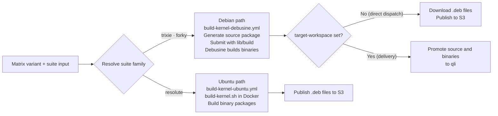
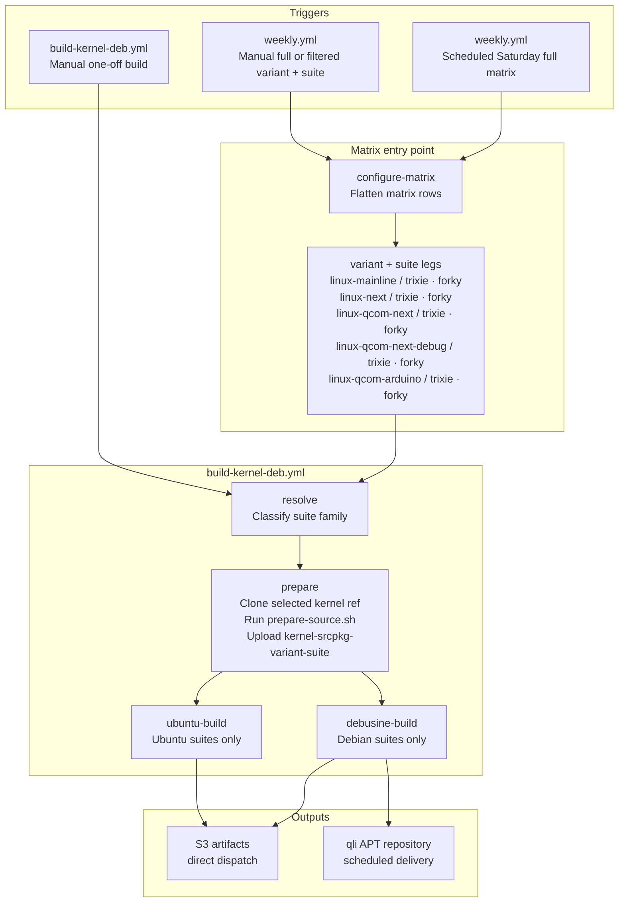
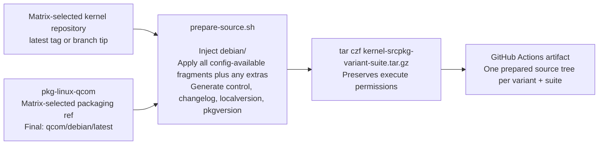
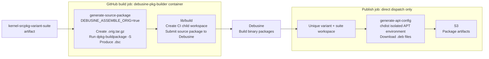
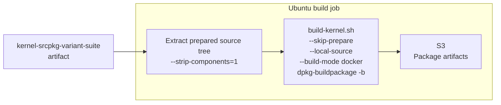

# pkg-linux-qcom

CI orchestration for ARM64 Linux kernel package variants. The delivered
variants build from
[`qualcomm-linux/kernel`](https://github.com/qualcomm-linux/kernel); each
variant names its own kernel source, so tracking variants can follow other
trees.

This branch owns the build matrix and GitHub Actions workflows. The Debian
packaging tree and local packaging tools live on
[`qcom/debian/latest`](https://github.com/qualcomm-linux/pkg-linux-qcom/tree/qcom/debian/latest).

## Overview

The CI model is matrix-driven. This single repository can deliver multiple
kernel variants, each with independent source/package identity, kernel source
and ref strategy, configuration fragments, Debian revision, target suites, and
release destination.

Each kernel variant is exactly one matrix row, and every row is the same kind
of delivery: resolve the row's kernel ref at run time from its `latest_tag` or
`branch_tip` strategy, build it, and promote it to `target_workspace` if the
build passes. No delivery pins a ref, so a matrix row is a standing description
of what to track rather than a record of one chosen commit, and a delivery
advances without anyone editing the matrix. There is no delivery type to
choose: a row has nothing left to say about how it is delivered. The resolver
expands every suite in a row into an isolated `variant + suite` build leg.

### Configured variants

| Variant | Source package | Image metapackage | Delivery (all trixie, forky) | Notes |
|---------|----------------|-------------------|--------------------------------|-------|
| `linux-mainline` | `linux-mainline` | `linux-image-mainline` | Weekly → `qli` | Tracks the tip of `master` in `torvalds/linux` |
| `linux-next` | `linux-next` | `linux-image-next` | Weekly → `qli` | Tracks the newest `next-YYYYMMDD` tag of the linux-next tree |
| `linux-qcom-next` | `linux-qcom-next` | `linux-image-qcom-next` | Weekly → `qli` | Standard kernel |
| `linux-qcom-next-debug` | `linux-qcom-next-debug` | `linux-image-qcom-next-debug` | Weekly → `qli` | Adds `arch/arm64/configs/qcom_debug.config` from the kernel source via `intree:qcom_debug` |
| `linux-qcom-arduino` | `linux-qcom-arduino` | `linux-image-qcom-arduino` | Weekly → `qli` | Tracks the tip of `early/hwe/arduino` in `qualcomm-linux/kernel-topics` |

Every variant name carries the `linux-` prefix and matches its source package,
so one name identifies the variant, the row, and the package it produces.

The two `linux-qcom-next` variants build the same kernel ref.
`derive-localversion.sh` folds the variant name into LOCALVERSION, so each
variant produces a distinct kernel release —
`-linux-qcom-next-<tag-date>-<build-date>` and
`-linux-qcom-next-debug-<tag-date>-<build-date>` from a dated tag,
`-linux-qcom-arduino-g<sha>-<build-date>` from a branch tip — and therefore a
distinct versioned image package that can be installed alongside the others.

`ci/build-matrix.json` is the source of truth; this table is a summary.

One scheduled entry point drives the pipeline:

- **Weekly** resolves each row's latest tag or branch tip, builds it, and
  promotes each leg whose build passed to that row's Debusine workspace.

`build-kernel-deb.yml` can also be dispatched by hand for a one-off build. It
never promotes; its packages go to S3.

The final Production matrix is conceptually:

```json
{
  "suite_suffix_mapping": {
    "trixie": "~bpo13+1",
    "forky": ""
  },
  "variants": [
    {
      "variant": "linux-qcom-next",
      "suites": ["trixie", "forky"],
      "git_clone": "https://github.com/qualcomm-linux/kernel",
      "branch_or_tag": "qcom-next",
      "ref_strategy": "latest_tag",
      "tag_pattern": "qcom-next-*",
      "srcpkg": "linux-qcom-next",
      "binpkg": "linux-image-qcom-next",
      "kernel_config": [],
      "debian_version_stub": "0qli",
      "pkg_linux_qcom_ref": "qcom/debian/latest",
      "target_workspace": "qli"
    }
  ]
}
```

`suite_suffix_mapping` is matrix-wide policy, not duplicated per row: every
suite referenced by any row's `suites` must have an entry here, and every
delivery derives its final `debian_revision` as
`debian_version_stub + suite_suffix_mapping[suite]`. For the values above:

| Suite | Delivery | Direct dispatch |
| --- | --- | --- |
| Trixie | `0qli~bpo13+1` | `0qli~bpo13+1~` |
| Forky | `0qli` | `0qli~` |

Successive deliveries order against each other by kernel version, which carries
the build date (see [Packages](#packages)); the revision does not vary between
them.

A build that is not promoted takes a trailing `~`, which always sorts below the
same prefix without it in Debian version ordering. Today the only such builds
are direct `build-kernel-deb.yml` dispatches, so a hand-run validation build can
never produce a version that outranks a real delivery.
Ordering across *different* suites depends entirely on the configured
suffixes: with the mapping above, Trixie < Forky, matching a
Debian-backports-then-unstable promotion chain.
This is a deliberate ordering policy, not an automatic guarantee — adding a
suite means choosing a suffix that sorts where that suite belongs relative to
the others.

`ci/build-matrix.json` is the authoritative configuration. Adding a kernel
variant is a one-row matrix change, not a workflow redesign.

## Workflows

| Workflow | Purpose | Trigger |
| --- | --- | --- |
| `weekly.yml` | Resolves and runs the matrix, promoting each leg that builds. | Scheduled Saturdays at `11:00 UTC`, or manual dispatch. |
| `build-kernel-deb.yml` | Reusable orchestrator for one kernel variant and suite. | Manual dispatch or called by `weekly.yml`. |
| `build-kernel-debusine.yml` | Builds Debian suites in Debusine and either promotes to a target workspace or publishes artifacts to S3. | Called by `build-kernel-deb.yml`. |
| `build-kernel-ubuntu.yml` | Builds Ubuntu-family suites with the Docker path. | Called by `build-kernel-deb.yml`. |

### Weekly

Weekly is the promotion path. Every variant that reaches `qli` reaches it this
way, and it bumps itself.

- The scheduled run is every Saturday at `11:00 UTC` and resolves the full
  matrix. A manual run selects one **Build scope**:
  - **Full matrix** builds every configured variant and suite.
  - **Selected variant (all suites)** builds every configured suite for one variant.
  - **Selected variant and suite** builds one isolated matrix leg.
- The ref comes from the row's `latest_tag` or `branch_tip` strategy, resolved
  at run time: `latest_tag` resolves the newest matching dated tag, `branch_tip`
  resolves the configured branch directly. Nothing is pinned, so each week picks
  up whatever that tree has moved to; a row never needs editing to advance.
- Each leg builds its Debian source and binary artifacts in its own per-variant,
  per-suite Debusine CI workspace, then is promoted with Debusine's
  `package-publish` workflow to the row's `target_workspace` — `qli` for every
  configured variant, where packages are served by the production Debusine APT
  repository.
- A leg is promoted only if its build succeeded. A leg whose build fails
  promotes nothing, and `fail-fast` is off, so one variant failing does not
  cancel another variant's promotion.
- Promotion runs in the **Production** GitHub environment, which supplies the
  release credential. Whatever approval protection that environment carries
  applies here too: the Saturday build runs unattended and the promotion waits
  on it. Making the promotion fully unattended is a change to that
  environment's protection rules, not to this workflow.
- No Ubuntu-family suite is configured at the moment. One that is added back
  (`resolute`, say) takes the Docker-based Ubuntu path and uploads its package
  outputs to the existing temporary-package S3 location; it also needs a
  `suite_suffix_mapping` entry restored.

Direct `build-kernel-deb.yml` dispatches are build-only. Promotion is initiated
exclusively by `weekly.yml`, which owns the target workspace and production
release controls.

## Matrix Model

`ci/build-matrix.json` is an object with two top-level keys: `variants`
(the matrix rows) and `suite_suffix_mapping` (matrix-wide Debian suffix
policy, shared by every variant). `ci/scripts/resolve-matrix.sh` validates the
document, requires each `variant` to appear in exactly one row, and
flattens each `suites` array into independent suite legs. Each leg carries its
own values for:

| Field | Purpose |
| --- | --- |
| `variant` | Stable identifier for a separately packaged kernel variant. Lowercase letters, digits, and internal hyphens only. |
| `suites` | Suites to flatten into individual build legs. Each must have a `suite_suffix_mapping` entry. |
| `git_clone` | Kernel source repository. |
| `branch_or_tag` | Source branch, used by `branch_tip`. Records the tracked branch for `latest_tag`, which ignores it. |
| `ref_strategy` | `latest_tag` or `branch_tip`. Both resolve at run time. |
| `tag_pattern` | Required only for `latest_tag`; matching tags must end in `-YYYYMMDD`, which determines newest-first ordering. |
| `srcpkg` | Debian source package name. |
| `binpkg` | Kernel image metapackage name. |
| `kernel_config` | Extra fragments applied on top of `debian/config-available/`, all of which is applied to every build, one per array element. Empty for variants that need nothing beyond it; today it carries only `intree:` fragments shipped by the kernel source. `resolve-matrix.sh` joins it into the comma-separated `kernel-config` workflow input. |
| `debian_version_stub` | Base Debian revision. Must not end in `~`; the suite suffix is derived, not stored here. |
| `localversion`, `kver_extra` | Optional version overrides forwarded to packaging. |
| `pkg_linux_qcom_ref` | Packaging branch or commit used during source preparation. |
| `debusine_parent_workspace` | Optional parent workspace override for the variant's CI child workspaces. |
| `target_workspace` | Debusine destination for the delivery. Required. |

`tag_pattern` is required for `latest_tag` and rejected for other strategies.
The resolver selects the most recent trailing `YYYYMMDD` date, and rejects
duplicate suites and malformed variant identifiers before any build jobs
start. It also rejects a matrix where any configured suite has no
`suite_suffix_mapping` entry, where two suites share the same suffix, where a
suffix is non-empty and doesn't start with `~`, or where one kernel variant is
spread across more than one row — all before any build job starts.

Each flattened leg's final `debian_revision` is derived by
`ci/scripts/derive-debian-revision.sh` from `debian_version_stub` and
`suite_suffix_mapping[suite]`. This script is the single implementation of the
formula: `resolve-matrix.sh` calls it once per flattened leg, and
`build-kernel-deb.yml`'s direct-dispatch path (which has no full-matrix
context) calls the same script with `--non-promoting` for the one suite it was
given.

Each leg has a distinct prepared-source artifact, Debusine child workspace, and
S3 path keyed by `variant + suite`. This prevents two variants that both
build, for example, `trixie` from consuming or publishing each other's inputs
or outputs.

S3 outputs, which today come only from direct `build-kernel-deb.yml`
dispatches, use these layouts, where `<run>` is
`<github.run_id>-<github.run_attempt>`:

```text
<org>/pkg/debusine/<repo>/<variant>/<suite>/<run>/
<org>/pkg/temp/<repo>/<variant>/<suite>/<run>/
```

The first layout is for Debian/Debusine builds; the second is for Ubuntu Docker
builds. Consumers must select the intended kernel variant and suite.

Supporting scripts keep workflow YAML small and testable:

| Script | Responsibility |
| --- | --- |
| `ci/scripts/resolve-matrix.sh` | Validates and flattens matrix rows. |
| `ci/scripts/resolve-kernel-ref.sh` | Resolves a matrix-selected dated tag or validates a direct ref. |
| `ci/scripts/derive-localversion.sh` | Derives `LOCALVERSION` from the variant, resolved kernel ref, and build date. |
| `ci/scripts/derive-debian-revision.sh` | Derives the final suite-specific `debian_revision` from `debian_version_stub` and `suite_suffix_mapping`. |

## Architecture


```mermaid
flowchart LR
    IN["Matrix variant + suite input"] --> R{"Resolve suite family"}

    R -->|"trixie · forky"| DEB["Debian path\nbuild-kernel-debusine.yml\nGenerate source package\nSubmit with lib/build\nDebusine builds binaries"]
    R -->|"resolute"| UBU["Ubuntu path\nbuild-kernel-ubuntu.yml\nbuild-kernel.sh in Docker\nBuild binary packages"]

    DEB --> DOUT{"target-workspace set?"}
    DOUT -->|"No (direct dispatch)"| S3["Download .deb files\nPublish to S3"]
    DOUT -->|"Yes (delivery)"| QLI["Promote source and binaries\nto qli"]
    UBU --> US3["Publish .deb files to S3"]
```

## For CI Maintainers

### Pipeline overview


```mermaid
flowchart TD
    subgraph triggers[Triggers]
        A1["weekly.yml\nScheduled Saturday full matrix"]
        A2["weekly.yml\nManual full or filtered variant + suite"]
        A3["build-kernel-deb.yml\nManual one-off build"]
    end

    subgraph matrix[Matrix entry point]
        B1["configure-matrix\nFlatten matrix rows"]
        B2["variant + suite legs\nlinux-mainline / trixie · forky\nlinux-next / trixie · forky\nlinux-qcom-next / trixie · forky\nlinux-qcom-next-debug / trixie · forky\nlinux-qcom-arduino / trixie · forky"]
    end

    subgraph orchestrator[build-kernel-deb.yml]
        C1["resolve\nClassify suite family"]
        C2["prepare\nClone selected kernel ref\nRun prepare-source.sh\nUpload kernel-srcpkg-variant-suite"]
        C3["debusine-build\nDebian suites only"]
        C4["ubuntu-build\nUbuntu suites only"]
    end

    subgraph outputs[Outputs]
        D1["S3 artifacts\ndirect dispatch"]
        D2["qli APT repository\nscheduled delivery"]
    end

    A1 --> B1
    A2 --> B1
    B1 --> B2 --> C1
    A3 --> C1
    C1 --> C2
    C2 --> C3 & C4
    C3 --> D1 & D2
    C4 --> D1
```

### Prepare stage


```mermaid
flowchart LR
    K["Matrix-selected kernel repository\nlatest tag or branch tip"] --> PS
    M["pkg-linux-qcom\nMatrix-selected packaging ref\nFinal: qcom/debian/latest"] --> PS

    PS["prepare-source.sh\n\nInject debian/\nApply all config-available fragments plus any extras\nGenerate control, changelog, localversion, pkgversion"] --> TAR
    TAR["tar czf kernel-srcpkg-variant-suite.tar.gz\nPreserves execute permissions"] --> ART
    ART["GitHub Actions artifact\nOne prepared source tree per variant + suite"]
```

> **Why `tar.gz`?** `actions/upload-artifact` uses zip internally, which strips
> Unix execute bits. Kernel build scripts require those permissions. The tar
> archive preserves them between the prepare and build jobs.

### Debian build and publish path


```mermaid
flowchart LR
    ART["kernel-srcpkg-variant-suite\nartifact"] --> GSP

    subgraph source[GitHub build job: debusine-pkg-builder container]
        GSP["generate-source-package\nDEBUSINE_ASSEMBLE_ORIG=true\n\nCreate .orig.tar.gz\nRun dpkg-buildpackage -S\nProduce .dsc"] --> SUBMIT
        SUBMIT["lib/build\nCreate CI child workspace\nSubmit source package to Debusine"]
    end

    SUBMIT --> DEB["Debusine\nBuild binary packages"]
    DEB --> WS["Unique variant + suite workspace"]

    subgraph publish[Publish job: direct dispatch only]
        WS --> APT["generate-apt-config\nchdist isolated APT environment\nDownload .deb files"]
        APT --> S3["S3\nPackage artifacts"]
    end
```

### Debian promotion path


```mermaid
flowchart LR
    ART["kernel-srcpkg-variant-suite\nartifact"] --> GSP["generate-source-package\nProduce .dsc"]
    GSP --> SUBMIT["lib/build\nSubmit source package to a unique\nDebusine CI child workspace"]
    SUBMIT --> DEB["Debusine\nBuild binary packages"]
    DEB --> WS["CI workspace\nsource and binary artifacts"]

    subgraph release[Promotion job: Production GitHub environment]
        WS --> PROMOTE["lib/release\nStart package-publish"]
        PROMOTE --> QLI["qli\nProduction Debusine APT repository"]
    end
```

### Ubuntu path


```mermaid
flowchart LR
    ART["kernel-srcpkg-variant-suite\nartifact"] --> EXT

    subgraph build[Ubuntu build job]
        EXT["Extract prepared source tree\n--strip-components=1"] --> BK
        BK["build-kernel.sh\n--skip-prepare\n--local-source\n--build-mode docker\ndpkg-buildpackage -b"] --> S3
    end

    S3["S3\nPackage artifacts"]
```

`--skip-prepare` is safe because `prepare-source.sh` has already generated the
packaging metadata and applied the config fragments before the artifact is
created.

## Packages

The matrix provides the source package and image metapackage identity. The
resolved kernel release remains the source of truth for versioned package names
and installed kernel paths.

For the current matrix, package generation produces:

| Package | Purpose |
| --- | --- |
| `linux-qcom-next_<version>.dsc` and related source files | Debian source package. |
| `linux-image-<kernelrelease>_<version>_arm64.deb` | Versioned kernel image, modules, DTBs, and boot assets. |
| `linux-image-qcom-next_<version>_arm64.deb` | Image metapackage that tracks the newest kernel image. |
| `linux-headers-<kernelrelease>_<version>_arm64.deb` | Versioned headers for DKMS and out-of-tree modules. |
| `linux-headers-qcom-next_<version>_arm64.deb` | Headers metapackage. |
| `linux-image-<kernelrelease>-dbg_<version>_arm64.deb` | Kernel and module debug symbols. |

Every LOCALVERSION ends in the build date, and the packaging rules read that
trailing `-YYYYMMDD` as the package version's upstream date component:

```text
LOCALVERSION     -linux-qcom-next-20260821-20260828   (tag date, then build date)
uname -r      7.2.0-rc7-linux-qcom-next-20260821-20260828
version              7.2.0~rc7+20260828-0qli
```

The build date is what makes one delivery's version sort above the last. A tag
date cannot do that job on its own — a week that adds no new tag would rebuild
the same version — and a branch tip has no date at all, so its SHA identifies
the commit while the build date orders the package. Two deliveries built the
same day from the same base kernel version do still collide; the cadences are
weekly, so that only arises from re-running a build by hand.

`-rcN` remains in `uname -r`, module paths, boot assets, and versioned package
names. Only the Debian version field converts it to `~rcN`, so a release
candidate correctly sorts before the corresponding final kernel release.

`KVER_EXTRA` is supported for explicit suffixes such as `-ci42` or `-local`.
The packaging rules verify that the declared versioned image package matches the
resolved kernel release and fail instead of creating inconsistent metadata.

For an APT repository installation, install the image metapackage:

```bash
sudo apt update
sudo apt install linux-image-qcom-next
```

When installing downloaded artifacts directly, install the versioned image and
its metapackage together. Add the headers packages when DKMS or other
out-of-tree module builds are required.

## Manual Builds

Use **Actions** → **build-kernel-deb** for a one-off build. It is an explicit
override workflow, not a matrix-derived delivery flow: use `weekly.yml` for
normal delivery operations.

`kernel-variant`, `suite`, and `ref-strategy` are the required build selection.
All remaining package, configuration, and PR inputs are advanced overrides for
validation or debugging. Variant and suite are free-text matrix values rather
than static dropdowns, so adding a matrix entry never requires editing the
workflow UI.

The available inputs are:

| Input | Default | Purpose |
| --- | --- | --- |
| `kernel-variant` | `linux-qcom-next` | Stable variant identifier used in artifact and workspace identity. |
| `suite` | `trixie` | Target suite. |
| `ref-strategy` | `latest_tag` | `latest_tag`, `branch_tip`, or `pinned_ref`. `pinned_ref` exists only for one-off dispatches; no matrix row may use it. |
| `kernel-branch` | `qcom-next` | Branch for `branch_tip`, or immutable ref for `pinned_ref`; ignored by `latest_tag`. |
| `tag-pattern` | `qcom-next-*` | Tag glob for `latest_tag`; ignored by `branch_tip` and `pinned_ref`. |
| `kernel-url` | `qualcomm-linux/kernel` | Advanced alternate kernel repository. |
| `srcpkg` | `linux-qcom-next` | Advanced source package identity override. |
| `binpkg` | `linux-image-qcom-next` | Advanced image metapackage identity override. |
| `kernel-config` | Empty | Advanced extra fragments applied on top of all of `debian/config-available/`, e.g. `intree:qcom_debug`. |
| `debian-version-stub` | `0qli` | Advanced Debian version stub. The selected suite's mapped suffix and a non-promoting trailing `~` are applied automatically, since a direct build is build-only and never promoted. |
| `localversion` | Auto-derived | Advanced explicit `LOCALVERSION` override. |
| `kver-extra` | Empty | Advanced kernel-release suffix. |
| `debug-build` | `false` | Advanced debug configuration toggle. |
| `pkg-linux-qcom-ref` | `qcom/debian/latest` | Advanced packaging revision used to prepare the source tree. |

The workflow also supports advanced Qualcomm-only PR overrides for validation
builds. Direct builds are artifact builds; promotion is performed only through
`weekly.yml`.

## Configuration

### Repository and organization variables

| Variable | Purpose |
| --- | --- |
| `ARTIFACT_S3_BUCKET` | S3 bucket for non-promoted Debian artifacts and Ubuntu build artifacts. |
| `DEBUSINE_HOST` | Production Debusine host. |
| `DEBUSINE_SCOPE` | Debusine scope. |
| `DEBUSINE_PARENT_WORKSPACE` | Parent workspace used to create per-run CI child workspaces. |

### Secrets

| Secret | Scope | Purpose |
| --- | --- | --- |
| `DEBUSINE_USER` | Repository | User for Debusine archive and signing-key access. |
| `DEBUSINE_TOKEN` | Repository | Token for Debusine build and artifact operations. |
| `DEBUSINE_RELEASE_TOKEN` | Production environment | Token used only to promote Weekly artifacts to `qli`. |

The Debian build and promotion jobs select the **Production** GitHub environment.
This makes environment-scoped release credentials available to the promotion job
and keeps production approval controls in the workflow path.

## Maintaining the Matrix

To add a kernel variant:

1. Add one row to `variants`. A variant is exactly one row;
   `resolve-matrix.sh` rejects a `variant` that appears more than once.
2. Define all package identity, source/ref strategy, configuration,
   `debian_version_stub`, `target_workspace`, and suite values in that row. Do
   not rely on another variant's values.
3. Use `latest_tag` with a dated tag glob, or `branch_tip`. Either orders
   correctly: `derive-localversion.sh` appends the build date whichever is
   used. Prefer `latest_tag` where the tree publishes dated tags, since the
   tag date also names the upstream snapshot in `uname -r`.
4. Give the variant distinct `srcpkg` and `binpkg` values.
5. Confirm suite-family routing: Debian suites use Debusine; Ubuntu suites use
   the Docker path.
6. Validate with a direct `build-kernel-deb.yml` dispatch, which builds without
   promoting, before letting a scheduled run promote it to `target_workspace`.

To add a new suite (for an existing or new variant):

1. Add an entry for it to the shared top-level `suite_suffix_mapping`, empty
   or starting with `~`, and distinct from every other suite's suffix.
2. Add the suite to the variant's `suites` array. `resolve-matrix.sh` rejects
   any configured suite with no mapping entry before any build job starts.
3. Choose the suffix so the suite sorts where it belongs relative to the
   others (see the ordering discussion in [Overview](#overview)).

No workflow dispatch choices need to be updated: manual `weekly.yml` inputs
accept matrix-defined variant and suite strings.

## Contributing

See [CONTRIBUTING.md](CONTRIBUTING.md) for branch, review, and DCO
requirements.

## License

pkg-linux-qcom is licensed under the BSD 3-Clause License. See
[LICENSE.txt](LICENSE.txt).
