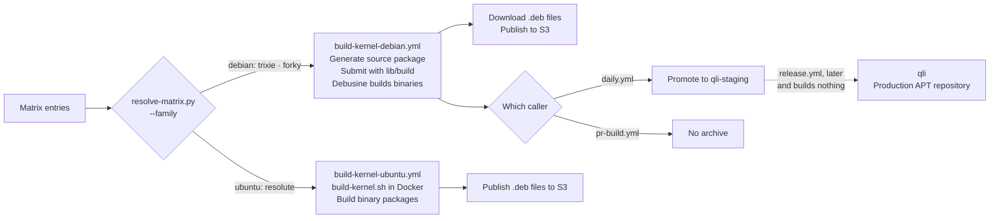
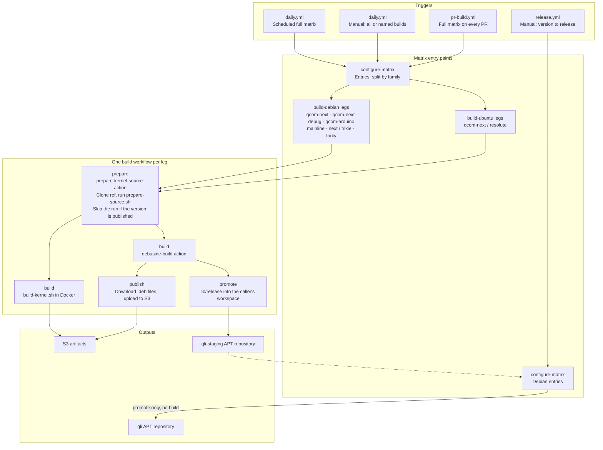
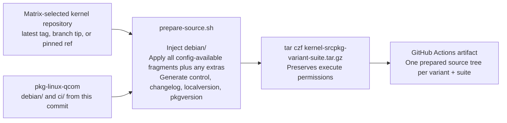
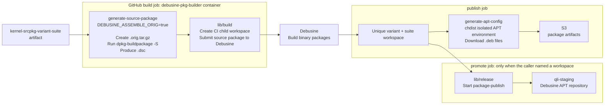
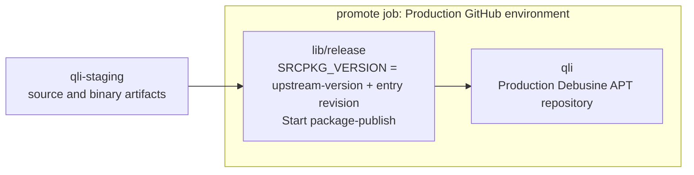
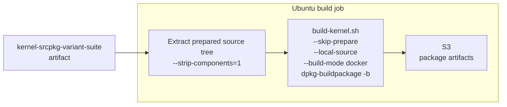

# pkg-linux-qcom

CI orchestration for ARM64 Linux kernel package variants. The configured
variants build from
[`qualcomm-linux/kernel`](https://github.com/qualcomm-linux/kernel).

This branch owns both halves of the chain: the build matrix and GitHub Actions
workflows, and the Debian packaging tree and local packaging tools. Every build
takes its packaging and its CI scripts from the same commit.

## Overview

The CI model is matrix-driven. This single repository can deliver multiple
kernel variants, each with independent source/package identity, kernel source
and ref strategy, configuration fragments, Debian revision, target suites, and
archive destination.

Every entry in the matrix is one isolated build leg producing one package. A
kernel flavour owns as many entries as it has suites.

### Configured variants

| Variant | Source package | Image metapackage | Suites | Notes |
|---------|----------------|-------------------|--------|-------|
| `qcom-next` | `linux-qcom-next` | `linux-image-qcom-next` | trixie, forky, resolute | Standard kernel |
| `qcom-next-debug` | `linux-qcom-next-debug` | `linux-image-qcom-next-debug` | trixie, forky | Adds `arch/arm64/configs/qcom_debug.config` and `kernel/configs/debug.config` from the kernel source, via `intree:` entries |
| `qcom-arduino` | `linux-qcom-arduino` | `linux-image-qcom-arduino` | trixie, forky | Arduino hardware-enablement topic branch (`early/hwe/arduino` of `kernel-topics`) |
| `mainline` | `linux-mainline` | `linux-image-mainline` | trixie, forky | Tip of Linus's tree, tracked for early warning of upstream breakage. No DKMS modules |
| `next` | `linux-next` | `linux-image-next` | trixie, forky | Newest `next-YYYYMMDD` tag of linux-next. No DKMS modules |

`derive-localversion.sh` folds the *flavour* into LOCALVERSION, so each
produces a distinct kernel release (`+qcom-next-<date>-g<sha>`,
`+qcom-next-debug-<date>-g<sha>`, and so on) and therefore a distinct versioned
image package that can be installed alongside the others. The flavour is what
the kernel is; a build's `name` is only what CI calls it. See
[docs/version.md](docs/version.md) for how the version strings are composed.

The last three track a moving upstream for early warning. They are built and
promoted like the rest; nothing about an entry says where it goes.

`ci/build-matrix.yaml` is the source of truth; this table is a summary.

There is one kind of entry, and one workflow that builds one:

- **`daily.yml`** builds every entry nightly, using the matrix-selected
  latest-tag or branch-tip strategy, and promotes its Debian entries into the
  staging workspace.
- **`release.yml`** builds nothing. It promotes a version that is already in a
  staging workspace onward into the release workspace.

Releasing therefore changes no file in this repository. The matrix describes
what is built; which build has been blessed is a decision made at dispatch
time, against versions that already exist.

One entry in `builds` is one generated package: a single `name` for a single
`suite`. The `name` labels that one build and nothing else — it is the Actions
job name and what a manual dispatch asks for. Nothing is expanded or derived at
resolve time, so what an entry says is what gets built:

```yaml
builds:
  - name: qcom-next-trixie
    suite: trixie
    flavour: qcom-next
    git_clone: https://github.com/qualcomm-linux/kernel
    branch_or_tag: qcom-next
    ref_strategy: latest_tag
    tag_pattern: 'qcom-next-*'
    srcpkg: linux-qcom-next
    binpkg: linux-image-qcom-next
    kernel_config: []
    dkms:
      - kgsl
      - camx
      - iris-vpu
      - audioreach
    debian_revision: '0qli1~bpo13+1~'
```

Entries are written out in full rather than sharing YAML anchors, so each one
can be read, grepped, and changed on its own. `resolve-matrix.py` enforces the
consistency that duplication would otherwise put at risk — see
[Matrix Model](#matrix-model).

Each entry states its `debian_revision` outright. The configured values are:

| Suite | Revision |
| --- | --- |
| Trixie | `0qli~bpo13+1~` |
| Forky | `0qli~` |
| Resolute | `0qli~26.04.1~` |

The trailing `~` marks the version as one nobody has blessed yet, and it stays
on the version through release. That is a consequence of releasing by
promotion: what reaches `qli` is the artifact `qli-staging` holds, byte for
byte, so its version is the version it was built with. A release that dropped
the `~` would have to be a different build, which is exactly what this design
removes.

Ordering across *different* suites depends entirely on the configured
revisions: with the values above, Resolute < Trixie < Forky, matching a
Debian-backports-then-unstable promotion chain. This is a deliberate ordering
policy, not an automatic guarantee — adding a suite means choosing a revision
that sorts where that suite belongs relative to the others.

`ci/build-matrix.yaml` is the authoritative configuration. Adding a kernel
variant is a matrix change, not a workflow redesign.

## Workflows

| Workflow | Purpose | Trigger |
| --- | --- | --- |
| `daily.yml` | Resolves and runs the matrix. The manual build entry point. | Scheduled daily at `23:00 UTC`, or manual dispatch. |
| `release.yml` | Promotes an already-built version into the release workspace. Builds nothing. | Manual dispatch only. |
| `build-kernel-debian.yml` | Builds one Debian-suite entry in Debusine, publishes it to S3, and promotes it into the workspace its caller named, if any. | Called by Daily and PR build. |
| `build-kernel-ubuntu.yml` | Builds one Ubuntu-suite entry on the Docker path and publishes it to S3. | Called by Daily and PR build. |

The two build workflows share their steps through two composite actions rather
than through a common orchestrator workflow:

| Action | Used by |
| --- | --- |
| `.github/actions/prepare-kernel-source` | Both, as the `prepare` job. |
| `.github/actions/debusine-build` | The Debian workflow, as the `build` job. |

Which of them a build leg calls is decided by the caller, from the entry's
suite: `resolve-matrix.py --family debian|ubuntu` splits the selection, and
each family's entries call only the workflow that builds them. Nothing inside a
build workflow is conditional on the suite, so a run starts exactly the jobs it
needs and shows no skipped job for a path it did not take.

### Daily

Daily is the only workflow that builds a kernel, and every package in every
archive comes from a run of it.

- The scheduled run resolves the full matrix.
- A manual run says which entries to build in one **Builds** field:
  - `all`, the default, builds every configured variant and suite.
  - A comma-separated list of build names builds those entries, e.g.
    `qcom-next-trixie,qcom-next-debug-forky`. A name matching no entry fails
    the run rather than narrowing it, and both families are selected from one
    list, so a mixed list starts Debian and Ubuntu legs from one dispatch.
- `latest_tag` resolves the newest matching dated tag; `branch_tip` resolves
  the configured branch directly.
- Debian suites build in Debusine, then their `.deb` outputs are downloaded and
  uploaded to the configured S3 bucket.
- Debian entries are then promoted into the staging workspace with Debusine's
  `package-publish` workflow, making them installable from that archive.
- Debian builds resolve their Build-Depends against `qli` alone. The nightly is
  the build a release promotes, so anything it builds against is something the
  released kernel will depend on; reading `qli-staging` here would let a kernel
  reach `qli` depending on a `-dkms` package that has not. A PR build resolves
  against `qli qli-staging`, because nothing it produces is promoted and a
  kernel and the module it needs should be reviewable together.
- `resolute` stays on the Docker-based Ubuntu path and uploads its package
  outputs to the existing temporary-package S3 location.

Because the package version is a function of the resolved ref and the entry's
revision, a night on which the tracked tag has not moved would rebuild a
version the archive already has and then fail promoting the duplicate. The
`prepare` job therefore asks the target workspace whether it already holds the
version this run would produce, and skips the build, the S3 publication and the
promotion when it does. A run that skips this way is green: nothing was wrong,
there was simply nothing new upstream.

Where a build is published belongs to the run, not to the entry: the nightly
names the staging workspace, and `pr-build.yml` names nothing, so a pull
request's kernel is built and tested but reaches no archive. Everything a
`daily` dispatch can say about a build comes from the matrix entry, so there is
no way to dispatch a build that differs from the nightly one at all.

### Release

Release is the controlled promotion path, and it builds nothing at all.

- It is manual only, and takes four fields: which **Builds** to release (`all`
  or a comma-separated list, as Daily does), the **Upstream version** to
  release, the **From workspace** to release out of (`qli-staging` by default,
  where the nightly build put the packages), and the **To workspace** to
  release into (`qli` by default).
- Each selected entry promotes `<upstream-version>-<its debian_revision>`. The
  upstream half is the kernel and the date its tag was cut, and is the same
  across the suites built from one ref; the revision half is the entry's own,
  because a suite's packages are versioned to sort against the other suites.
- Only the Debian entries can be released, because promotion runs through
  Debusine and only they are built there. Naming an Ubuntu build fails the run
  with the list of entries that can be released.
- Promotion uses Debusine's `package-publish` workflow, the same operation the
  nightly build performs one step earlier.
- The job runs in the **Production** GitHub environment, which provides the
  release credential and enforces the approval gate.

Releasing changes no file in this repository: there is no ref to pin and no
entry to add, because the version being released has already been built. The
release decision is the dispatch.

## Matrix Model

`ci/build-matrix.yaml` is a mapping with exactly one top-level key, `builds`.
One entry in it is one generated package, so there is no
expansion step: `ci/scripts/resolve-matrix.py` validates the whole document,
selects the entries matching the requested names, variant, and suite, and hands
them to the workflow matrix as they stand. Each entry carries:

| Field | Purpose |
| --- | --- |
| `name` | The name of this one build, and nothing else: its Actions job name, and what a manual dispatch asks for. Unique across the matrix. Never reaches a package name, a version, or a published path. Lowercase letters, digits, and internal hyphens only, and not `all`, which a dispatch reads as every entry. |
| `suite` | The one suite this entry builds for. |
| `flavour` | The kernel's own identity, and the only matrix field that reaches the built kernel. `derive-localversion.sh` makes it the LOCALVERSION suffix, so two flavours built from one ref get distinct kernel releases and their `linux-image` packages coexist. All entries sharing a flavour build the same package for different suites. |
| `git_clone` | Kernel source repository. |
| `branch_or_tag` | Source branch or pinned tag, according to `ref_strategy`. |
| `ref_strategy` | `latest_tag`, `branch_tip`, or `pinned_ref`. |
| `tag_pattern` | Required only for `latest_tag`; matching tags must end in `-YYYYMMDD`, which determines newest-first ordering. |
| `srcpkg` | Debian source package name. |
| `binpkg` | Kernel image metapackage name. |
| `kernel_config` | Extra fragments applied on top of `debian/config-available/`, all of which is applied to every build, one per list element. A bare name selects `debian/config-available/<name>.config`; an `intree:` entry names a fragment shipped by the kernel source, as a path relative to the kernel source root (e.g. `intree:arch/arm64/configs/qcom_debug.config`), so it stays versioned with the kernel it targets. Empty for variants that need nothing beyond `config-available/`; today it carries only `intree:` fragments. `resolve-matrix.py` joins it into the comma-separated `kernel-config` workflow input. |
| `dkms` | Out-of-tree DKMS modules built and bundled into the image package, one per list element, each named without the `-dkms` suffix (e.g. `kgsl`). Each needs a `<name>-dkms` package in the suite being built for, so this varies between suites. An empty list bundles nothing. A listed module is a presence contract: a build fails rather than shipping an image without it. `resolve-matrix.py` joins it into the comma-separated `dkms` workflow input, which reaches `prepare-source.sh --dkms`; see [debian/README.md](debian/README.md) for what the packaging does with it. |
| `debian_revision` | The Debian revision this package is built at, stated outright. Carried into every archive the package reaches, because a release promotes the built artifact rather than rebuilding it. |
| `localversion`, `kver_extra` | Optional version overrides forwarded to packaging. |
| `debusine_parent_workspace` | Optional parent workspace override for the variant's CI child workspaces. |

`resolve-matrix.py` rejects the matrix — before any build job starts — where an
entry has an unknown field or a missing required one, a malformed variant or
suite identifier, an unknown `ref_strategy`, a `tag_pattern` without
`latest_tag`, a `kernel_config` fragment that escapes the kernel source root
or collides with another fragment's filename, a `dkms` entry that is not a package name stem or repeats,
or a `debian_revision` that is not a valid Debian revision.

Because entries are written out in full, the resolver also checks the
invariants that span them, which is what makes the duplication safe to read at
face value:

- No two entries share a `name` — a name identifies exactly one build, so a run
  cannot produce two jobs with one name and a dispatch cannot be ambiguous.
- A flavour's entries agree on `srcpkg`, `binpkg` and `kernel_config`; those
  decide what the package *is*, and the entries differ only in where it goes.
- A flavour's entries for one suite agree on `dkms`. The module set depends on
  which `<name>-dkms` packages the target archive carries, so it varies between
  suites but not within one.
- A flavour's entries agree on `git_clone`, `branch_or_tag`, `ref_strategy` and
  `tag_pattern`, so a forgotten suite cannot quietly ship a different kernel
  from its siblings.
- No `srcpkg` or `binpkg` is shared between flavours, and no two entries build
  the same `srcpkg` at the same `debian_revision`.

The build workflows pass their entry's own `debian_revision` through. A caller
with no entry in hand can leave the `debian-revision` input empty, and the
`prepare-kernel-source` action looks up the entry for the build name and suite
it was given (`resolve-matrix.py --field debian_revision`) and builds at the
revision the nightly build uses.

Each entry has a distinct prepared-source artifact, Debusine child workspace,
and S3 path keyed by `flavour + suite`. This prevents two flavours that both
build, for example, `trixie` from consuming or publishing each other's inputs
or outputs. They key on `flavour`, not on the build's `name`, so renaming a
build never moves a published artifact.

S3 outputs use these layouts, where `<run>` is
`<github.run_id>-<github.run_attempt>`:

```text
<org>/pkg/debusine/<repo>/<flavour>/<suite>/<run>/
<org>/pkg/temp/<repo>/<flavour>/<suite>/<run>/
```

The first layout is for Debian/Debusine builds; the second is for Ubuntu Docker
builds. Consumers must select the intended flavour and suite.

Supporting scripts keep workflow YAML small and testable:

| Script | Responsibility |
| --- | --- |
| `ci/scripts/resolve-matrix.py` | Validates the delivery matrix and selects the entries to build. Needs PyYAML (`python3-yaml`). |
| `ci/scripts/resolve-kernel-ref.sh` | Resolves a matrix-selected dated tag or validates a direct ref. |
| `ci/scripts/derive-localversion.sh` | Derives the version fields from the flavour, resolved kernel ref and HEAD, printing `LOCALVERSION=`, `SNAPSHOT=` and `GITSHA=` lines. `SNAPSHOT` is the dated component of the Debian version: the tag's date, or the HEAD commit date for a branch-tip build. Scheme and rationale: [docs/version.md](docs/version.md). |

## Architecture

This repository contains two separate parts:
- the CI generator (`.github/workflows/`, `ci/`) that decides *what* to build,
- the Debian packaging (`debian/`, `prepare-source.sh`, `build-kernel.sh`) that
  decides *how* it is built.

This document covers the CI generator. For the packaging internals: `debian/rules`
targets, the config fragment merge pipeline, DKMS module bundling and the produced
package layout see [debian/README.md](debian/README.md).

Both branches below are taken in the caller. The family follows from the
entry's suite; the promotion follows from which workflow is running. By the
time a build workflow starts, there is nothing left to decide.


```mermaid
flowchart LR
    IN["Matrix entries"] --> R{"resolve-matrix.py\n--family"}

    R -->|"debian: trixie · forky"| DEB["build-kernel-debian.yml\nGenerate source package\nSubmit with lib/build\nDebusine builds binaries"]
    R -->|"ubuntu: resolute"| UBU["build-kernel-ubuntu.yml\nbuild-kernel.sh in Docker\nBuild binary packages"]

    DEB --> S3["Download .deb files\nPublish to S3"]
    DEB --> TW{"Which caller"}
    TW -->|"daily.yml"| STG["Promote to qli-staging"]
    TW -->|"pr-build.yml"| NONE["No archive"]
    UBU --> US3["Publish .deb files to S3"]

    STG -.->|"release.yml, later\nand builds nothing"| QLI["qli\nProduction APT repository"]
```

## For CI Maintainers

### Pipeline overview


```mermaid
flowchart TD
    subgraph triggers[Triggers]
        A1["daily.yml\nScheduled full matrix"]
        A2["daily.yml\nManual: all or named builds"]
        A5["pr-build.yml\nFull matrix on every PR"]
        A3["release.yml\nManual: version to release"]
    end

    subgraph matrix[Matrix entry points]
        B1["configure-matrix\nEntries, split by family"]
        B2["build-debian legs\nqcom-next · qcom-next-debug · qcom-arduino\nmainline · next / trixie · forky"]
        B5["build-ubuntu legs\nqcom-next / resolute"]
        B3["configure-matrix\nDebian entries"]
    end

    subgraph build[One build workflow per leg]
        C2["prepare\nprepare-kernel-source action\nClone ref, run prepare-source.sh\nSkip the run if the version is published"]
        C3["build\ndebusine-build action"]
        C4["build\nbuild-kernel.sh in Docker"]
        C5["publish\nDownload .deb files, upload to S3"]
        C6["promote\nlib/release into the caller's workspace"]
    end

    subgraph outputs[Outputs]
        D1["S3 artifacts"]
        D3["qli-staging APT repository"]
        D2["qli APT repository"]
    end

    A1 --> B1
    A2 --> B1
    A5 --> B1
    B1 --> B2 & B5
    B2 --> C2
    B5 --> C2
    C2 --> C3 & C4
    C3 --> C5 & C6
    C4 --> D1
    C5 --> D1
    C6 --> D3
    A3 --> B3
    B3 -->|"promote only, no build"| D2
    D3 -.-> B3
```

A leg runs every job drawn under it except `promote`, which only a caller
naming a workspace reaches. `release.yml` touches none of the build column: it
reads what is already in `qli-staging`.

### Prepare stage


```mermaid
flowchart LR
    K["Matrix-selected kernel repository\nlatest tag, branch tip, or pinned ref"] --> PS
    M["pkg-linux-qcom\ndebian/ and ci/ from this commit"] --> PS

    PS["prepare-source.sh\n\nInject debian/\nApply all config-available fragments plus any extras\nGenerate control, changelog, localversion, pkgversion"] --> TAR
    TAR["tar czf kernel-srcpkg-variant-suite.tar.gz\nPreserves execute permissions"] --> ART
    ART["GitHub Actions artifact\nOne prepared source tree per variant + suite"]
```

> **Why `tar.gz`?** `actions/upload-artifact` uses zip internally, which strips
> Unix execute bits. Kernel build scripts require those permissions. The tar
> archive preserves them between the prepare and build jobs.

### Debian build path


```mermaid
flowchart LR
    ART["kernel-srcpkg-variant-suite\nartifact"] --> GSP

    subgraph source[GitHub build job: debusine-pkg-builder container]
        GSP["generate-source-package\nDEBUSINE_ASSEMBLE_ORIG=true\n\nCreate .orig.tar.gz\nRun dpkg-buildpackage -S\nProduce .dsc"] --> SUBMIT
        SUBMIT["lib/build\nCreate CI child workspace\nSubmit source package to Debusine"]
    end

    SUBMIT --> DEB["Debusine\nBuild binary packages"]
    DEB --> WS["Unique variant + suite workspace"]

    subgraph publish[publish job]
        WS --> APT["generate-apt-config\nchdist isolated APT environment\nDownload .deb files"]
        APT --> S3["S3\npackage artifacts"]
    end

    subgraph promote[promote job: only when the caller named a workspace]
        WS --> PROMOTE["lib/release\nStart package-publish"]
        PROMOTE --> STG["qli-staging\nDebusine APT repository"]
    end
```

### Release path

Nothing is built. `release.yml` promotes a version that the nightly build
already put in `qli-staging`.


```mermaid
flowchart LR
    STG["qli-staging\nsource and binary artifacts"] --> PROMOTE

    subgraph release[promote job: Production GitHub environment]
        PROMOTE["lib/release\nSRCPKG_VERSION = upstream-version + entry revision\nStart package-publish"]
        PROMOTE --> QLI["qli\nProduction Debusine APT repository"]
    end
```

### Ubuntu path


```mermaid
flowchart LR
    ART["kernel-srcpkg-variant-suite\nartifact"] --> EXT

    subgraph build[Ubuntu build job]
        EXT["Extract prepared source tree\n--strip-components=1"] --> BK
        BK["build-kernel.sh\n--skip-prepare\n--local-source\n--build-mode docker\ndpkg-buildpackage -b"] --> S3
    end

    S3["S3\npackage artifacts"]
```

`--skip-prepare` is safe because `prepare-source.sh` has already generated the
packaging metadata and applied the config fragments before the artifact is
created.

## Packages

The matrix provides the source package and image metapackage identity. The
resolved kernel release remains the source of truth for versioned package names
and installed kernel paths.

For the current matrix, package generation produces:

| Package | Purpose |
| --- | --- |
| `linux-qcom-next_<version>.dsc` and related source files | Debian source package. |
| `linux-image-<kernelrelease>_<version>_arm64.deb` | Versioned kernel image, modules, DTBs, and boot assets. |
| `linux-image-qcom-next_<version>_arm64.deb` | Image metapackage that tracks the newest kernel image. |
| `linux-headers-<kernelrelease>_<version>_arm64.deb` | Versioned headers for DKMS and out-of-tree modules. |
| `linux-headers-qcom-next_<version>_arm64.deb` | Headers metapackage. |
| `linux-image-<kernelrelease>-dbg_<version>_arm64.deb` | Kernel and module debug symbols. |

`-rcN` remains in `uname -r`, module paths, boot assets, and versioned package
names. Only the Debian version field converts it to `~rcN`, so a release
candidate correctly sorts before the corresponding final kernel release.

Every build names both its snapshot and the commit it was cut from:

| | Format | Example |
| --- | --- | --- |
| Kernel release (`uname -r`) | `<base>+<variant>-<date>[.<respin>]-g<sha>` | `7.2.0-rc7+qcom-next-20260826.1-g011a82096bee` |
| Debian version | `<base>+git<date>[.<respin>]~g<sha>-<revision>` | `7.2.0~rc7+git20260826.1~g011a82096bee-0qli1~bpo13+1` |

The two strings spell the same fields differently because they are compared by
different rules — `+` and `~` are both load-bearing, not stylistic. See
[docs/version.md](docs/version.md) before changing either.

`KVER_EXTRA` is supported for explicit suffixes such as `-ci42` or `-local`.
The packaging rules verify that the declared versioned image package matches the
resolved kernel release and fail instead of creating inconsistent metadata.

For an APT repository installation, install the image metapackage:

```bash
sudo apt update
sudo apt install linux-image-qcom-next
```

When installing downloaded artifacts directly, install the versioned image and
its metapackage together. Add the headers packages when DKMS or other
out-of-tree module builds are required.

## Manual Builds

Use **Actions** → **daily** → **Run workflow** for a one-off build, and
**Actions** → **release** to promote a version that has already been built.
Both name what to act on in one **Builds** field.

| Input | Default | Purpose |
| --- | --- | --- |
| `builds` | `all` | `all` selects every entry — for `release`, every Debian entry. Otherwise a comma-separated list of build `name` values from `ci/build-matrix.yaml`, e.g. `qcom-next-trixie,qcom-next-debug-forky`. |

Everything else about a build — its suite, flavour, kernel repository and ref,
package names, config fragments, DKMS modules and Debian revision — comes from
the entry, so there is nothing to retype and nothing to get wrong. Build names
are free-text matrix values rather than a static dropdown, so adding a matrix
entry never requires editing the workflow UI, and a name that matches no entry
fails the run with the list of names that do. `daily` routes each selected
entry to the workflow that builds its family, so one dispatch can name Debian
and Ubuntu builds together.

`release` carries two further inputs, because a promotion has to say what it is
promoting:

| Input | Default | Purpose |
| --- | --- | --- |
| `upstream-version` | None, required | The version to release without its Debian revision, e.g. `7.2.0~rc7+20260821`. Each selected entry promotes this plus its own `debian_revision`. |
| `from-workspace` | `qli-staging` | The Debusine workspace to promote out of, where the nightly build put the packages. |
| `to-workspace` | `qli` | The Debusine workspace to promote into. |

A `daily` dispatch publishes to S3 and promotes its Debian entries into the
staging workspace, exactly as the scheduled run does. Promotion into the
release workspace happens only through `release.yml`. The build workflows themselves
(`build-kernel-debian.yml`, `build-kernel-ubuntu.yml`) are `workflow_call` only
and cannot be dispatched: one run of each is one matrix entry, and a reusable
workflow cannot fan itself out over a list.

## Configuration

### Repository and organization variables

| Variable | Purpose |
| --- | --- |
| `ARTIFACT_S3_BUCKET` | S3 bucket for Debian and Ubuntu build artifacts. |
| `DEBUSINE_HOST` | Production Debusine host. |
| `DEBUSINE_SCOPE` | Debusine scope. |
| `DEBUSINE_PARENT_WORKSPACE` | Parent workspace used to create per-run CI child workspaces. |

### Secrets

| Secret | Scope | Purpose |
| --- | --- | --- |
| `DEBUSINE_USER` | Repository | User for Debusine archive and signing-key access. |
| `DEBUSINE_TOKEN` | Repository | Token for Debusine build and artifact operations, including the nightly promotion into `qli-staging`. |
| `DEBUSINE_RELEASE_TOKEN` | Production environment | Token used only to promote into the release workspace. |

The `build` and `promote` jobs of `build-kernel-debian.yml` select the
**Staging** GitHub environment; the promotion job of `release.yml` selects
**Production**. That split is what lets the nightly build promote into
`qli-staging` unattended while a release into `qli` still passes through the
production approval gate. `DEBUSINE_TOKEN` therefore needs write access to
`qli-staging`.

## Maintaining the Matrix

To add a kernel variant:

1. Add one entry to `builds` per package the variant should produce: one per
   suite, each spelling out all of its own fields, and each with a `name`
   unique across the matrix. Do not rely on another variant's values.
2. Give them all the same `flavour`, distinct from every other flavour's — it
   becomes the LOCALVERSION suffix, so this is what lets the new kernel install
   alongside the existing ones. Keep `srcpkg`, `binpkg`, `kernel_config` and
   the ref fields identical across every entry for the flavour.
   `resolve-matrix.py` rejects the matrix if they drift apart.
3. Use `latest_tag` with a dated tag glob, or `branch_tip`, to track a moving
   upstream; `pinned_ref` freezes the variant on one ref.
4. Give the variant distinct `srcpkg` and `binpkg` values.
5. Give each entry a `debian_revision` that sorts where its suite belongs
   relative to the others and collides with no other entry building the same
   `srcpkg`.
6. Confirm suite-family routing: Debian suites use Debusine; Ubuntu suites use
   the Docker path.
7. Run a filtered daily validation for the new variant, then a full daily run.
   Nothing further is needed to release it: once its packages are in the
   staging workspace, `release.yml` can promote them.

To add a new suite (for an existing or new variant):

1. Add one entry for the suite, copying one of the variant's existing entries
   and changing `suite` and `debian_revision`.
2. Choose the revision so the suite sorts where it belongs relative to the
   others (see the ordering discussion in [Overview](#overview)), and so it
   does not collide with another entry building the same `srcpkg`.

No workflow dispatch choices need to be updated: the daily and release
dispatches take build names as free text, so a new entry is dispatchable by
name, and is picked up by `all`, as soon as it is merged.

Run `ci/scripts/resolve-matrix.py` locally to validate a matrix change before
pushing it; it validates the whole document regardless of what it selects.

## Contributing

See [CONTRIBUTING.md](CONTRIBUTING.md) for branch, review, and DCO
requirements.

## License

pkg-linux-qcom is licensed under the BSD 3-Clause License. See
[LICENSE.txt](LICENSE.txt).
