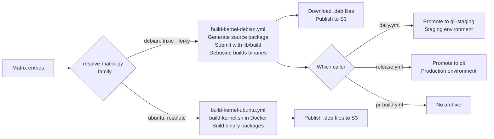
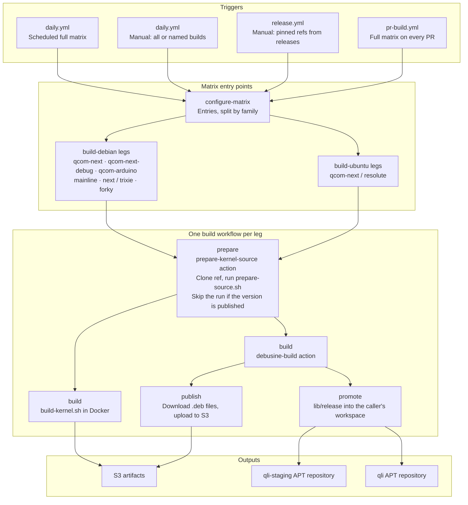
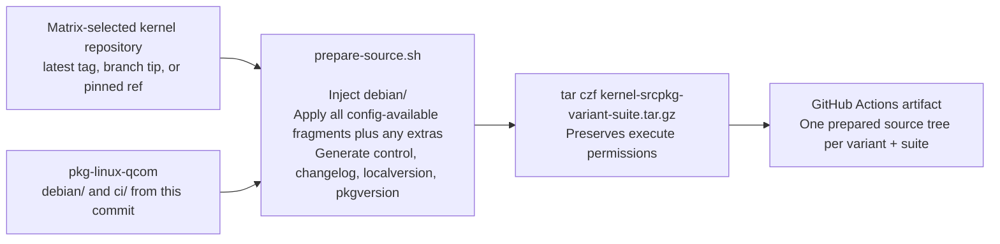
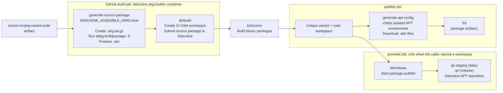
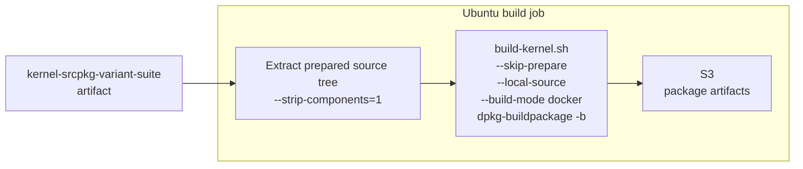

# pkg-linux-qcom

CI orchestration for ARM64 Linux kernel package variants. The configured
variants build from
[`qualcomm-linux/kernel`](https://github.com/qualcomm-linux/kernel).

This branch owns both halves of the chain: the build matrix and GitHub Actions
workflows, and the Debian packaging tree and local packaging tools. Every build
takes its packaging and its CI scripts from the same commit.

## Overview

The CI model is matrix-driven. This single repository can deliver multiple
kernel variants, each with independent source/package identity, kernel source
and ref strategy, configuration fragments, Debian revision, target suites, and
archive destination.

Every entry in the matrix is one isolated build leg producing one package. A
kernel flavour owns as many entries as it has suites.

### Configured variants

| Variant | Source package | Image metapackage | Suites | Notes |
|---------|----------------|-------------------|--------|-------|
| `qcom-next` | `linux-qcom-next` | `linux-image-qcom-next` | trixie, forky, resolute | Standard kernel |
| `qcom-next-debug` | `linux-qcom-next-debug` | `linux-image-qcom-next-debug` | trixie, forky | Adds `arch/arm64/configs/qcom_debug.config` and `kernel/configs/debug.config` from the kernel source, via `intree:` entries |
| `qcom-arduino` | `linux-qcom-arduino` | `linux-image-qcom-arduino` | trixie, forky | Arduino hardware-enablement topic branch (`early/hwe/arduino` of `kernel-topics`) |
| `mainline` | `linux-mainline` | `linux-image-mainline` | trixie, forky | Tip of Linus's tree, tracked for early warning of upstream breakage. No DKMS modules |
| `next` | `linux-next` | `linux-image-next` | trixie, forky | Newest `next-YYYYMMDD` tag of linux-next. No DKMS modules |

`derive-localversion.sh` folds the *flavour* into LOCALVERSION, so each
produces a distinct kernel release (`+qcom-next-<date>-g<sha>`,
`+qcom-next-debug-<date>-g<sha>`, and so on) and therefore a distinct versioned
image package that can be installed alongside the others. The flavour is what
the kernel is; a build's `name` is only what CI calls it. See
[docs/version.md](docs/version.md) for how the version strings are composed.

The last three track a moving upstream for early warning. They are built and
promoted like the rest; nothing about an entry says where it goes.

`ci/build-matrix.yaml` is the source of truth; this table is a summary.

Entries come in two lists, each with a workflow that builds them:

- **`daily.yml`** builds every `builds` entry nightly, using the matrix-selected
  latest-tag or branch-tip strategy, and promotes its Debian entries into the
  staging archive as part of the build that produced them.
- **`release.yml`** builds a `releases` entry on request, from the immutable ref
  that entry pins, and promotes it into `qli` behind an approval.

Neither publishes a build some earlier run produced. The Debusine workspace a
build runs in is named after that run and does not outlive it, so the only
moment its contents can be published is while the run still holds it —
promotion is in the build or it is nowhere, and a release therefore builds the
ref it ships rather than promoting a nightly. What the archive carries is
therefore always an artifact some nightly run built and tested.

One entry in `builds` is one generated package: a single `name` for a single
`suite`. The `name` labels that one build and nothing else — it is the Actions
job name and what a manual dispatch asks for. Nothing is expanded or derived at
resolve time, so what an entry says is what gets built:

```yaml
builds:
  - name: qcom-next-trixie
    suite: trixie
    flavour: qcom-next
    git_clone: https://github.com/qualcomm-linux/kernel
    branch_or_tag: qcom-next
    ref_strategy: latest_tag
    tag_pattern: 'qcom-next-*'
    srcpkg: linux-qcom-next
    binpkg: linux-image-qcom-next
    kernel_config: []
    dkms:
      - kgsl
      - camx
      - iris-vpu
      - audioreach
    debian_revision: '0qli1~bpo13+1'
```

Entries are written out in full rather than sharing YAML anchors, so each one
can be read, grepped, and changed on its own. `resolve-matrix.py` enforces the
consistency that duplication would otherwise put at risk — see
[Matrix Model](#matrix-model).

Each entry states its `debian_revision` outright. The configured values are:

| Suite | Revision |
| --- | --- |
| Trixie | `0qli1~bpo13+1` |
| Forky | `0qli1` |
| Resolute | `0qli1~26.04.1` |

None of them carries a trailing `~`. That marker existed to sort a daily build
below the release rebuilt from the same ref, and there is no such rebuild: the
version is decided once, when the package is built, and the artifact any
archive holds is that one. With nothing for it to sort against, a trailing `~`
would only make every published kernel look permanently provisional.

Ordering across *different* suites depends entirely on the configured
revisions: with the values above, Resolute < Trixie < Forky, matching a
Debian-backports-then-unstable promotion chain. This is a deliberate ordering
policy, not an automatic guarantee — adding a suite means choosing a revision
that sorts where that suite belongs relative to the others.

`ci/build-matrix.yaml` is the authoritative configuration. Adding a kernel
variant is a matrix change, not a workflow redesign.

## Workflows

| Workflow | Purpose | Trigger |
| --- | --- | --- |
| `daily.yml` | Resolves and runs the matrix. The manual build entry point. | Scheduled daily at `23:00 UTC`, or manual dispatch. |
| `release.yml` | Builds the pinned refs in the matrix's `releases` list and promotes them into the released archive. | Manual dispatch only. |
| `build-kernel-debian.yml` | Builds one Debian-suite entry in Debusine, publishes it to S3, and promotes it into the workspace its caller named, if any. | Called by Daily, Release and PR build. |
| `build-kernel-ubuntu.yml` | Builds one Ubuntu-suite entry on the Docker path and publishes it to S3. | Called by Daily and PR build. |

The two build workflows share their steps through two composite actions rather
than through a common orchestrator workflow:

| Action | Used by |
| --- | --- |
| `.github/actions/prepare-kernel-source` | Both, as the `prepare` job. |
| `.github/actions/debusine-build` | The Debian workflow, as the `build` job. |

Which of them a build leg calls is decided by the caller, from the entry's
suite: `resolve-matrix.py --family debian|ubuntu` splits the selection, and
each family's entries call only the workflow that builds them. Nothing inside a
build workflow is conditional on the suite, so a run starts exactly the jobs it
needs and shows no skipped job for a path it did not take.

### Daily

Daily builds every entry in the matrix, and everything in the staging archive
comes from a run of it.

- The scheduled run resolves the full matrix.
- A manual run says which entries to build in one **Builds** field:
  - `all`, the default, builds every configured variant and suite.
  - A comma-separated list of build names builds those entries, e.g.
    `qcom-next-trixie,qcom-next-debug-forky`. A name matching no entry fails
    the run rather than narrowing it, and both families are selected from one
    list, so a mixed list starts Debian and Ubuntu legs from one dispatch.
- `latest_tag` resolves the newest matching dated tag; `branch_tip` resolves
  the configured branch directly.
- Debian suites build in Debusine, then their `.deb` outputs are downloaded and
  uploaded to the configured S3 bucket.
- Debian entries are then promoted into the staging workspace with Debusine's
  `package-publish` workflow, making them installable from that archive.
- Debian builds resolve their Build-Depends against `qli` alone. The nightly
  is the build whose output is published, so anything it builds against is
  something the published kernel depends on; reading `qli-staging` here would
  let a kernel be published depending on a `-dkms` package that has not been
  released. A PR build resolves against `qli qli-staging`, because nothing it
  produces is promoted and a kernel and the module it needs should be
  reviewable together.
- `resolute` stays on the Docker-based Ubuntu path and uploads its package
  outputs to the existing temporary-package S3 location.

Because the package version is a function of the resolved ref and the entry's
revision, a night on which the tracked tag has not moved would rebuild a
version the archive already has and then fail promoting the duplicate. The
`prepare` job therefore asks the target workspace whether it already holds the
version this run would produce, and skips the build, the S3 publication and the
promotion when it does. A run that skips this way is green: nothing was wrong,
there was simply nothing new upstream.

Where a build is published belongs to the run, not to the entry: the nightly
names the staging workspace, and `pr-build.yml` names nothing, so a pull
request's kernel is built and tested but reaches no archive. Everything a
`daily` dispatch can say about a build comes from the matrix entry, so there is
no way to dispatch a build that differs from the nightly one at all.

### Release

A release builds the ref it releases, and publishes the result into `qli`.

- Every value describing a release lives in `ci/build-matrix.yaml` under
  `releases`: the pinned ref, the suites, the packaging, and the
  `target_workspace` each entry publishes into. A dispatch only says which
  entries to run, in the same **Builds** field Daily uses.
- Updating a release is a pull request that changes `branch_or_tag`. That is
  what puts the ref that ships under review, rather than a version typed into
  a dispatch form at the moment of releasing.
- `ref_strategy` must be `pinned_ref`. `latest_tag` would make two dispatches
  of one entry release different kernels, and `branch_tip` would make them
  release whatever the branch had reached.
- Debian suites only, and `resolve-matrix.py` rejects anything else: promotion
  runs through Debusine, and the Ubuntu path has no workspace to promote into.
- The `promote` job runs in the **Production** environment, so whatever
  approval that environment requires stands between the run and the archive.
- Build-Depends resolve against `qli` alone, as the nightly's do, so a released
  kernel cannot depend on a `-dkms` package that has not itself been released.

It rebuilds rather than promoting a nightly because there is nothing left to
promote from: the CI workspace a nightly ran in is named after that run and does
not outlive it. What reaches `qli` is therefore the artifact this run built and
tested, from a ref that cannot have moved since it was reviewed.

### Publishing

Promotion happens inside the build, in the `promote` job of
`build-kernel-debian.yml`, using Debusine's `package-publish` workflow.

- It reads the ephemeral CI child workspace the build ran in and publishes the
  source and binary artifacts into the workspace the caller named.
- It is in-run by necessity. `lib/build` names that workspace
  `<parent>-gh-<repo-id>-<run-id>-<attempt>-<leg>`, creating it fresh for the
  run and not keeping it afterwards, so a later workflow would have neither the
  name nor the contents to promote. Publishing is part of the build or it does
  not happen.
- Only the Debian family reaches it, because promotion runs through Debusine
  and the Ubuntu path does not build there.
- Which GitHub environment it runs in is the caller's, through
  `promote-environment`. Daily leaves it at **Staging** and promotes
  unattended, because `qli-staging` is where an unreviewed nightly kernel
  belongs; Release passes **Production**, so an approval stands in front of
  `qli`.

A nightly promotion changes no file in this repository: there is no ref to pin
and no entry to bless, because what is published is what was built. A release
does, and that is the difference between them — the ref it ships is written
down and reviewed before the run that ships it.

#### Moving the nightly to `qli`

`qli-staging` is the nightly's destination, set by `DEBUSINE_STAGING_WORKSPACE`
and defaulted in [daily.yml](.github/workflows/daily.yml). Pointing that
variable at `qli` would publish every night's kernel straight into the released
archive with nothing in between, and the approval gate that
`promote-environment` provides would then have to be applied to every nightly
run — stopping each of them to wait for one. The two archives, with
`release.yml` between them, are what keep nightlies unattended and `qli` gated.

## Matrix Model

`ci/build-matrix.yaml` is a mapping with two top-level keys, `builds` and
`releases`. One entry in either is one generated package, so there is no
expansion step: `ci/scripts/resolve-matrix.py` validates the whole document,
selects the entries matching the requested names, variant, and suite, and hands
them to the workflow matrix as they stand.

The two lists have the same shape and are validated separately, so a name may
appear in both and means the same build in each. `builds` is what Daily runs
nightly; `releases` is what `release.yml` can ship, selected with
`--releases`. Both are validated on every invocation whichever is asked for, so
a broken release entry fails a nightly run rather than waiting to be found by
whoever next tries to release. Each entry carries:

| Field | Purpose |
| --- | --- |
| `name` | The name of this one build, and nothing else: its Actions job name, and what a manual dispatch asks for. Unique across the matrix. Never reaches a package name, a version, or a published path. Lowercase letters, digits, and internal hyphens only, and not `all`, which a dispatch reads as every entry. |
| `suite` | The one suite this entry builds for. |
| `flavour` | The kernel's own identity, and the only matrix field that reaches the built kernel. `derive-localversion.sh` makes it the LOCALVERSION suffix, so two flavours built from one ref get distinct kernel releases and their `linux-image` packages coexist. All entries sharing a flavour build the same package for different suites. |
| `git_clone` | Kernel source repository. |
| `branch_or_tag` | Source branch or pinned tag, according to `ref_strategy`. |
| `ref_strategy` | `latest_tag`, `branch_tip`, or `pinned_ref`. |
| `tag_pattern` | Required only for `latest_tag`; matching tags must end in `-YYYYMMDD`, which determines newest-first ordering. |
| `srcpkg` | Debian source package name. |
| `binpkg` | Kernel image metapackage name. |
| `kernel_config` | Extra fragments applied on top of `debian/config-available/`, all of which is applied to every build, one per list element. A bare name selects `debian/config-available/<name>.config`; an `intree:` entry names a fragment shipped by the kernel source, as a path relative to the kernel source root (e.g. `intree:arch/arm64/configs/qcom_debug.config`), so it stays versioned with the kernel it targets. Empty for variants that need nothing beyond `config-available/`; today it carries only `intree:` fragments. `resolve-matrix.py` joins it into the comma-separated `kernel-config` workflow input. |
| `dkms` | Out-of-tree DKMS modules built and bundled into the image package, one per list element, each named without the `-dkms` suffix (e.g. `kgsl`). Each needs a `<name>-dkms` package in the suite being built for, so this varies between suites. An empty list bundles nothing. A listed module is a presence contract: a build fails rather than shipping an image without it. `resolve-matrix.py` joins it into the comma-separated `dkms` workflow input, which reaches `prepare-source.sh --dkms`; see [debian/README.md](debian/README.md) for what the packaging does with it. |
| `debian_revision` | The Debian revision this package is built at, stated outright. Carried into the archive as built, because publishing promotes the artifact rather than rebuilding it. |
| `localversion`, `kver_extra` | Optional version overrides forwarded to packaging. |
| `debusine_parent_workspace` | Optional parent workspace override for the variant's CI child workspaces. |
| `target_workspace` | **`releases` only, and required there.** The Debusine workspace this entry publishes into. It is the one field a `builds` entry may not carry: where a nightly goes follows from why it is running, and is the calling workflow's to decide, while a release exists precisely to put one ref into one archive. |

`resolve-matrix.py` rejects the matrix — before any build job starts — where an
entry has an unknown field or a missing required one, a malformed variant or
suite identifier, an unknown `ref_strategy`, a `tag_pattern` without
`latest_tag`, a `kernel_config` fragment that escapes the kernel source root
or collides with another fragment's filename, a `dkms` entry that is not a package name stem or repeats,
or a `debian_revision` that is not a valid Debian revision.

A `releases` entry is held to two rules of its own: `ref_strategy` must be
`pinned_ref`, so releasing twice releases the same kernel, and `suite` must be
a Debian one, because only that path can promote into a workspace.

Because entries are written out in full, the resolver also checks the
invariants that span them, which is what makes the duplication safe to read at
face value:

- No two entries share a `name` — a name identifies exactly one build, so a run
  cannot produce two jobs with one name and a dispatch cannot be ambiguous.
- A flavour's entries agree on `srcpkg`, `binpkg` and `kernel_config`; those
  decide what the package *is*, and the entries differ only in where it goes.
- A flavour's entries for one suite agree on `dkms`. The module set depends on
  which `<name>-dkms` packages the target archive carries, so it varies between
  suites but not within one.
- A flavour's entries agree on `git_clone`, `branch_or_tag`, `ref_strategy` and
  `tag_pattern`, so a forgotten suite cannot quietly ship a different kernel
  from its siblings.
- No `srcpkg` or `binpkg` is shared between flavours, and no two entries build
  the same `srcpkg` at the same `debian_revision`.

The build workflows pass their entry's own `debian_revision` through. A caller
with no entry in hand can leave the `debian-revision` input empty, and the
`prepare-kernel-source` action looks up the entry for the build name and suite
it was given (`resolve-matrix.py --field debian_revision`) and builds at the
revision the nightly build uses.

Each entry has a distinct prepared-source artifact, Debusine child workspace,
and S3 path keyed by `flavour + suite`. This prevents two flavours that both
build, for example, `trixie` from consuming or publishing each other's inputs
or outputs. They key on `flavour`, not on the build's `name`, so renaming a
build never moves a published artifact.

S3 outputs use these layouts, where `<run>` is
`<github.run_id>-<github.run_attempt>`:

```text
<org>/pkg/debusine/<repo>/<flavour>/<suite>/<run>/
<org>/pkg/temp/<repo>/<flavour>/<suite>/<run>/
```

The first layout is for Debian/Debusine builds; the second is for Ubuntu Docker
builds. Consumers must select the intended flavour and suite.

Supporting scripts keep workflow YAML small and testable:

| Script | Responsibility |
| --- | --- |
| `ci/scripts/resolve-matrix.py` | Validates the delivery matrix and selects the entries to build. Needs PyYAML (`python3-yaml`). |
| `ci/scripts/resolve-kernel-ref.sh` | Resolves a matrix-selected dated tag or validates a direct ref. |
| `ci/scripts/derive-localversion.sh` | Derives the version fields from the flavour, resolved kernel ref and HEAD, printing `LOCALVERSION=`, `SNAPSHOT=` and `GITSHA=` lines. `SNAPSHOT` is the dated component of the Debian version: the tag's date, or the HEAD commit date for a branch-tip build. Scheme and rationale: [docs/version.md](docs/version.md). |

## Architecture

This repository contains two separate parts:
- the CI generator (`.github/workflows/`, `ci/`) that decides *what* to build,
- the Debian packaging (`debian/`, `prepare-source.sh`, `build-kernel.sh`) that
  decides *how* it is built.

This document covers the CI generator. For the packaging internals: `debian/rules`
targets, the config fragment merge pipeline, DKMS module bundling and the produced
package layout see [debian/README.md](debian/README.md).

Both branches below are taken in the caller. The family follows from the
entry's suite; the promotion follows from which workflow is running. By the
time a build workflow starts, there is nothing left to decide.


```mermaid
flowchart LR
    IN["Matrix entries"] --> R{"resolve-matrix.py\n--family"}

    R -->|"debian: trixie · forky"| DEB["build-kernel-debian.yml\nGenerate source package\nSubmit with lib/build\nDebusine builds binaries"]
    R -->|"ubuntu: resolute"| UBU["build-kernel-ubuntu.yml\nbuild-kernel.sh in Docker\nBuild binary packages"]

    DEB --> S3["Download .deb files\nPublish to S3"]
    DEB --> TW{"Which caller"}
    TW -->|"daily.yml"| STG["Promote to qli-staging\nStaging environment"]
    TW -->|"release.yml"| REL["Promote to qli\nProduction environment"]
    TW -->|"pr-build.yml"| NONE["No archive"]
    UBU --> US3["Publish .deb files to S3"]

```

## For CI Maintainers

### Pipeline overview


```mermaid
flowchart TD
    subgraph triggers[Triggers]
        A1["daily.yml\nScheduled full matrix"]
        A2["daily.yml\nManual: all or named builds"]
        A3["release.yml\nManual: pinned refs from releases"]
        A5["pr-build.yml\nFull matrix on every PR"]
    end

    subgraph matrix[Matrix entry points]
        B1["configure-matrix\nEntries, split by family"]
        B2["build-debian legs\nqcom-next · qcom-next-debug · qcom-arduino\nmainline · next / trixie · forky"]
        B5["build-ubuntu legs\nqcom-next / resolute"]
    end

    subgraph build[One build workflow per leg]
        C2["prepare\nprepare-kernel-source action\nClone ref, run prepare-source.sh\nSkip the run if the version is published"]
        C3["build\ndebusine-build action"]
        C4["build\nbuild-kernel.sh in Docker"]
        C5["publish\nDownload .deb files, upload to S3"]
        C6["promote\nlib/release into the caller's workspace"]
    end

    subgraph outputs[Outputs]
        D1["S3 artifacts"]
        D3["qli-staging APT repository"]
        D4["qli APT repository"]
    end

    A1 --> B1
    A2 --> B1
    A3 --> B1
    A5 --> B1
    B1 --> B2 & B5
    B2 --> C2
    B5 --> C2
    C2 --> C3 & C4
    C3 --> C5 & C6
    C4 --> D1
    C5 --> D1
    C6 --> D3 & D4
```

A leg runs every job drawn under it except `promote`, which only a caller
naming a workspace reaches — so a PR build stops at S3. Which archive `promote`
reaches, and whether it waits for an approval first, is that caller's too: the
nightly goes to `qli-staging` unattended, and a release to `qli` through the
Production environment.

### Prepare stage


```mermaid
flowchart LR
    K["Matrix-selected kernel repository\nlatest tag, branch tip, or pinned ref"] --> PS
    M["pkg-linux-qcom\ndebian/ and ci/ from this commit"] --> PS

    PS["prepare-source.sh\n\nInject debian/\nApply all config-available fragments plus any extras\nGenerate control, changelog, localversion, pkgversion"] --> TAR
    TAR["tar czf kernel-srcpkg-variant-suite.tar.gz\nPreserves execute permissions"] --> ART
    ART["GitHub Actions artifact\nOne prepared source tree per variant + suite"]
```

> **Why `tar.gz`?** `actions/upload-artifact` uses zip internally, which strips
> Unix execute bits. Kernel build scripts require those permissions. The tar
> archive preserves them between the prepare and build jobs.

### Debian build path


```mermaid
flowchart LR
    ART["kernel-srcpkg-variant-suite\nartifact"] --> GSP

    subgraph source[GitHub build job: debusine-pkg-builder container]
        GSP["generate-source-package\nDEBUSINE_ASSEMBLE_ORIG=true\n\nCreate .orig.tar.gz\nRun dpkg-buildpackage -S\nProduce .dsc"] --> SUBMIT
        SUBMIT["lib/build\nCreate CI child workspace\nSubmit source package to Debusine"]
    end

    SUBMIT --> DEB["Debusine\nBuild binary packages"]
    DEB --> WS["Unique variant + suite workspace"]

    subgraph publish[publish job]
        WS --> APT["generate-apt-config\nchdist isolated APT environment\nDownload .deb files"]
        APT --> S3["S3\npackage artifacts"]
    end

    subgraph promote[promote job: only when the caller named a workspace]
        WS --> PROMOTE["lib/release\nStart package-publish"]
        PROMOTE --> STG["qli-staging (daily)\nqli (release)\nDebusine APT repository"]
    end
```

### Ubuntu path


```mermaid
flowchart LR
    ART["kernel-srcpkg-variant-suite\nartifact"] --> EXT

    subgraph build[Ubuntu build job]
        EXT["Extract prepared source tree\n--strip-components=1"] --> BK
        BK["build-kernel.sh\n--skip-prepare\n--local-source\n--build-mode docker\ndpkg-buildpackage -b"] --> S3
    end

    S3["S3\npackage artifacts"]
```

`--skip-prepare` is safe because `prepare-source.sh` has already generated the
packaging metadata and applied the config fragments before the artifact is
created.

## Packages

The matrix provides the source package and image metapackage identity. The
resolved kernel release remains the source of truth for versioned package names
and installed kernel paths.

For the current matrix, package generation produces:

| Package | Purpose |
| --- | --- |
| `linux-qcom-next_<version>.dsc` and related source files | Debian source package. |
| `linux-image-<kernelrelease>_<version>_arm64.deb` | Versioned kernel image, modules, DTBs, and boot assets. |
| `linux-image-qcom-next_<version>_arm64.deb` | Image metapackage that tracks the newest kernel image. |
| `linux-headers-<kernelrelease>_<version>_arm64.deb` | Versioned headers for DKMS and out-of-tree modules. |
| `linux-headers-qcom-next_<version>_arm64.deb` | Headers metapackage. |
| `linux-image-<kernelrelease>-dbg_<version>_arm64.deb` | Kernel and module debug symbols. |

`-rcN` remains in `uname -r`, module paths, boot assets, and versioned package
names. Only the Debian version field converts it to `~rcN`, so a release
candidate correctly sorts before the corresponding final kernel release.

Every build names both its snapshot and the commit it was cut from:

| | Format | Example |
| --- | --- | --- |
| Kernel release (`uname -r`) | `<base>+<variant>-<date>[.<respin>]-g<sha>` | `7.2.0-rc7+qcom-next-20260826.1-g011a82096bee` |
| Debian version | `<base>+git<date>[.<respin>]~g<sha>-<revision>` | `7.2.0~rc7+git20260826.1~g011a82096bee-0qli1~bpo13+1` |

The two strings spell the same fields differently because they are compared by
different rules — `+` and `~` are both load-bearing, not stylistic. See
[docs/version.md](docs/version.md) before changing either.

`KVER_EXTRA` is supported for explicit suffixes such as `-ci42` or `-local`.
The packaging rules verify that the declared versioned image package matches the
resolved kernel release and fail instead of creating inconsistent metadata.

For an APT repository installation, install the image metapackage:

```bash
sudo apt update
sudo apt install linux-image-qcom-next
```

When installing downloaded artifacts directly, install the versioned image and
its metapackage together. Add the headers packages when DKMS or other
out-of-tree module builds are required.

## Manual Builds

Use **Actions** → **daily** → **Run workflow** for a one-off build. It names
what to build in one **Builds** field, and takes nothing else.

| Input | Default | Purpose |
| --- | --- | --- |
| `builds` | `all` | `all` selects every entry. Otherwise a comma-separated list of build `name` values from `ci/build-matrix.yaml`, e.g. `qcom-next-trixie,qcom-next-debug-forky`. |

Everything else about a build — its suite, flavour, kernel repository and ref,
package names, config fragments, DKMS modules and Debian revision — comes from
the entry, so there is nothing to retype and nothing to get wrong. Build names
are free-text matrix values rather than a static dropdown, so adding a matrix
entry never requires editing the workflow UI, and a name that matches no entry
fails the run with the list of names that do. `daily` routes each selected
entry to the workflow that builds its family, so one dispatch can name Debian
and Ubuntu builds together.

A `daily` dispatch is not a lesser run: it publishes to S3 and promotes its
Debian entries into the archive exactly as the scheduled run does, because a
dispatch cannot describe a build that differs from the nightly one. The build
workflows themselves (`build-kernel-debian.yml`, `build-kernel-ubuntu.yml`) are
`workflow_call` only and cannot be dispatched: one run of each is one matrix
entry, and a reusable workflow cannot fan itself out over a list.

### Releasing

Use **Actions** → **release** → **Run workflow**. It takes the same **Builds**
field, selecting from the matrix's `releases` list rather than from `builds`,
and nothing else — the ref, the packaging and the destination archive are all
the entry's.

Release a kernel by opening a pull request that sets `branch_or_tag` on the
entries being released, merging it, and dispatching `release` for those names.
The run stops at the `promote` job for the Production environment's approval,
having already built, published to S3 and printed what it is about to release
in the run summary, so the approval is given against the refs and versions in
front of you.

## Configuration

### Repository and organization variables

| Variable | Purpose |
| --- | --- |
| `ARTIFACT_S3_BUCKET` | S3 bucket for Debian and Ubuntu build artifacts. |
| `DEBUSINE_HOST` | Production Debusine host. |
| `DEBUSINE_SCOPE` | Debusine scope. |
| `DEBUSINE_PARENT_WORKSPACE` | Parent workspace used to create per-run CI child workspaces. |
| `DEBUSINE_STAGING_WORKSPACE` | Workspace the nightly build promotes into. Defaults to `qli-staging`; see [Moving the nightly to `qli`](#moving-the-nightly-to-qli) before changing it. A release names its workspace in the matrix instead, so this does not affect it. |

### Secrets

| Secret | Scope | Purpose |
| --- | --- | --- |
| `DEBUSINE_USER` | Repository | User for Debusine archive and signing-key access. |
| `DEBUSINE_TOKEN` | Repository | Token for Debusine build and artifact operations, including the nightly promotion into `qli-staging`. |

The `build` job of `build-kernel-debian.yml` always selects the **Staging**
GitHub environment. The `promote` job selects whichever its caller names
through `promote-environment`: **Staging** for the nightly, which is what lets
it promote unattended, and **Production** for a release, which is what makes it
wait for an approval.

`DEBUSINE_TOKEN` is what both promotions authenticate with, so it needs write
access to `DEBUSINE_STAGING_WORKSPACE` and to every `target_workspace` the
`releases` list names — `qli` included. `DEBUSINE_RELEASE_TOKEN` is not read by
any workflow; a release is gated by the Production environment rather than by a
credential of its own.

## Maintaining the Matrix

To add a kernel variant:

1. Add one entry to `builds` per package the variant should produce: one per
   suite, each spelling out all of its own fields, and each with a `name`
   unique across the matrix. Do not rely on another variant's values.
2. Give them all the same `flavour`, distinct from every other flavour's — it
   becomes the LOCALVERSION suffix, so this is what lets the new kernel install
   alongside the existing ones. Keep `srcpkg`, `binpkg`, `kernel_config` and
   the ref fields identical across every entry for the flavour.
   `resolve-matrix.py` rejects the matrix if they drift apart.
3. Use `latest_tag` with a dated tag glob, or `branch_tip`, to track a moving
   upstream; `pinned_ref` freezes the variant on one ref.
4. Give the variant distinct `srcpkg` and `binpkg` values.
5. Give each entry a `debian_revision` that sorts where its suite belongs
   relative to the others and collides with no other entry building the same
   `srcpkg`.
6. Confirm suite-family routing: Debian suites use Debusine; Ubuntu suites use
   the Docker path.
7. Run a filtered daily validation for the new variant, then a full daily run.
   Nothing further is needed to publish it: a successful nightly build of a
   Debian entry promotes itself.

To add a new suite (for an existing or new variant):

1. Add one entry for the suite, copying one of the variant's existing entries
   and changing `suite` and `debian_revision`.
2. Choose the revision so the suite sorts where it belongs relative to the
   others (see the ordering discussion in [Overview](#overview)), and so it
   does not collide with another entry building the same `srcpkg`.

To make a variant releasable, add the matching entries to `releases`: the same
fields, plus `target_workspace`, with `ref_strategy: pinned_ref` and
`branch_or_tag` naming the ref that ships. A variant with no `releases` entries
is built nightly and never shipped, which is the right state for a topic branch
or a tracking build.

No workflow dispatch choices need to be updated: the daily and release
dispatches take build names as free text, so a new entry is dispatchable by
name, and is picked up by `all`, as soon as it is merged.

Run `ci/scripts/resolve-matrix.py` locally to validate a matrix change before
pushing it; it validates the whole document regardless of what it selects.

## Contributing

See [CONTRIBUTING.md](CONTRIBUTING.md) for branch, review, and DCO
requirements.

## License

pkg-linux-qcom is licensed under the BSD 3-Clause License. See
[LICENSE.txt](LICENSE.txt).
